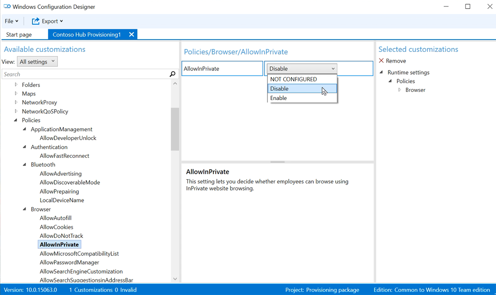

# <a name="create-provisioning-packages-for-surface-hub"></a><span data-ttu-id="27fa1-104">Создание пакетов для Surface Hub</span><span class="sxs-lookup"><span data-stu-id="27fa1-104">Create provisioning packages for Surface Hub</span></span>

<span data-ttu-id="27fa1-105">Пакеты подготовка позволяют автоматизировать развертывание ключевых функций, помогая обеспечить согласованную функцию во всех центрах surface в вашей организации.</span><span class="sxs-lookup"><span data-stu-id="27fa1-105">Provisioning packages allow you to automate deployment of key features, helping deliver a consistent experience across all Surface Hubs in your organization.</span></span>  <span data-ttu-id="27fa1-106">Используя Windows (WCD) на отдельном компьютере, вы можете выполнить следующие задачи:</span><span class="sxs-lookup"><span data-stu-id="27fa1-106">Using  Windows Configuration Designer (WCD) on a separate PC, you can complete the following tasks:</span></span>

- <span data-ttu-id="27fa1-107">Регистрация в Active Directory или Azure Active Directory</span><span class="sxs-lookup"><span data-stu-id="27fa1-107">Enroll in Active Directory or Azure Active Directory</span></span>
- <span data-ttu-id="27fa1-108">Создание учетной записи администратора устройства</span><span class="sxs-lookup"><span data-stu-id="27fa1-108">Create a device administrator account</span></span>
- <span data-ttu-id="27fa1-109">добавить приложения и сертификаты;</span><span class="sxs-lookup"><span data-stu-id="27fa1-109">Add applications and certificates</span></span>
- <span data-ttu-id="27fa1-110">настроить параметры прокси-сервера;</span><span class="sxs-lookup"><span data-stu-id="27fa1-110">Configure proxy settings</span></span>
- <span data-ttu-id="27fa1-111">добавить файл конфигурации Surface Hub.</span><span class="sxs-lookup"><span data-stu-id="27fa1-111">Add a Surface Hub configuration file</span></span>
- <span data-ttu-id="27fa1-112">Настройка [параметров поставщика служб конфигурации (CSP)](/windows/client-management/mdm/surfacehub-csp)</span><span class="sxs-lookup"><span data-stu-id="27fa1-112">Configure [Configuration Service Provider (CSP) settings](/windows/client-management/mdm/surfacehub-csp)</span></span>

## <a name="overview"></a><span data-ttu-id="27fa1-113">Обзор</span><span class="sxs-lookup"><span data-stu-id="27fa1-113">Overview</span></span>

1. <span data-ttu-id="27fa1-114">На отдельном компьютере с Windows 10 установите [Windows конструктор конфигурации](https://www.microsoft.com/store/apps/9nblggh4tx22) из Microsoft Store.</span><span class="sxs-lookup"><span data-stu-id="27fa1-114">On a separate PC running Windows 10, install [Windows Configuration Designer](https://www.microsoft.com/store/apps/9nblggh4tx22) from the Microsoft Store.</span></span>
1. <span data-ttu-id="27fa1-115">Выберите [**Surface Hub для**](#use-surface-hub-provisioning-wizard) настройки общих параметров с помощью мастера.</span><span class="sxs-lookup"><span data-stu-id="27fa1-115">Select [**Provision Surface Hub devices**](#use-surface-hub-provisioning-wizard) to configure common settings using a wizard.</span></span> <span data-ttu-id="27fa1-116">Или выберите [advanced provisioning](#use-advanced-provisioning) для просмотра и настройки всех возможных параметров.</span><span class="sxs-lookup"><span data-stu-id="27fa1-116">Or select [Advanced provisioning](#use-advanced-provisioning) to view and configure all possible settings.</span></span>
1. <span data-ttu-id="27fa1-117">Создайте пакет подготовка и сохраните его на USB-диске.</span><span class="sxs-lookup"><span data-stu-id="27fa1-117">Create the provisioning package and save it to a USB drive.</span></span>
1. <span data-ttu-id="27fa1-118">Развертывание пакета в Surface Hub во время установки первого запуска или через Параметры приложение.</span><span class="sxs-lookup"><span data-stu-id="27fa1-118">Deploy the package to your Surface Hub during first-run setup, or through the Settings app.</span></span> <span data-ttu-id="27fa1-119">Дополнительные дополнительные возможности см. [в см. в пункте Создание](/windows/configuration/provisioning-packages/provisioning-create-package)пакета подготовка для Windows 10.</span><span class="sxs-lookup"><span data-stu-id="27fa1-119">To learn more, see [Create a provisioning package for Windows 10](/windows/configuration/provisioning-packages/provisioning-create-package).</span></span>

## <a name="use-surface-hub-provisioning-wizard"></a><span data-ttu-id="27fa1-120">Используйте мастер Surface Hub подготовка</span><span class="sxs-lookup"><span data-stu-id="27fa1-120">Use Surface Hub provisioning wizard</span></span>

1. <span data-ttu-id="27fa1-121">Откройте Windows и выберите **устройства Provision Surface Hub.**</span><span class="sxs-lookup"><span data-stu-id="27fa1-121">Open Windows Configuration Designer and select **Provision Surface Hub devices**.</span></span><br>
    
    
2. <span data-ttu-id="27fa1-123">Назови свой проект и выберите **Далее**.</span><span class="sxs-lookup"><span data-stu-id="27fa1-123">Name your project and select **Next**.</span></span>

### <a name="add-certificates"></a><span data-ttu-id="27fa1-124">Добавление сертификатов</span><span class="sxs-lookup"><span data-stu-id="27fa1-124">Add certificates</span></span>

> [!div class="mx-imgBorder"]
> 

<span data-ttu-id="27fa1-126">Для предоставления устройства сертификата выберите **Добавить сертификат.**</span><span class="sxs-lookup"><span data-stu-id="27fa1-126">To provision the device with a certificate, select **Add a certificate**.</span></span> <span data-ttu-id="27fa1-127">Введите имя сертификата и выберите используемый сертификат.</span><span class="sxs-lookup"><span data-stu-id="27fa1-127">Enter a name for the certificate, and then browse to select the certificate to be used.</span></span>  <span data-ttu-id="27fa1-128">Дополнительные параметры обеспечения см. в разделе [Добавление сертификата в пакет.](#add-a-certificate-to-your-package)</span><span class="sxs-lookup"><span data-stu-id="27fa1-128">For advanced provisioning options, refer to the section below [Add a certificate to your package](#add-a-certificate-to-your-package).</span></span>

### <a name="configure-proxy-settings"></a><span data-ttu-id="27fa1-129">настроить параметры прокси-сервера;</span><span class="sxs-lookup"><span data-stu-id="27fa1-129">Configure proxy settings</span></span>

> [!div class="mx-imgBorder"]
> 

1. <span data-ttu-id="27fa1-131">Выберите **Да** или **Нет** для параметров прокси-сервера.</span><span class="sxs-lookup"><span data-stu-id="27fa1-131">Toggle **Yes** or **No** for proxy settings.</span></span> <span data-ttu-id="27fa1-132">По умолчанию Surface Hub автоматически обнаруживает параметры прокси.</span><span class="sxs-lookup"><span data-stu-id="27fa1-132">By default, Surface Hub automatically detects proxy settings.</span></span> <span data-ttu-id="27fa1-133">Тем не менее, если ранее инфраструктура требовала использование прокси-сервера, но теперь этого не требует, можно восстановить параметры по умолчанию для устройств Surface Hub с помощью пакета подготовки. Для этого выберите **Да** и **Автоматически определять параметры**.</span><span class="sxs-lookup"><span data-stu-id="27fa1-133">However, if your infrastructure previously required using a proxy server and has changed to not require a proxy server, you can use a provisioning package to revert your Surface Hub devices to the default settings by selecting **Yes** and **Automatically detect settings**.</span></span>
2. <span data-ttu-id="27fa1-134">Если вы переключение **Да,** вы можете выбрать для автоматического обнаружения параметров прокси или вручную настроить параметры, введите один из следующих:</span><span class="sxs-lookup"><span data-stu-id="27fa1-134">If you toggle **Yes**, you can select to automatically detect proxy settings or manually configure the settings by entering one of the following:</span></span>

    - <span data-ttu-id="27fa1-135">URL-адрес сценария установки.</span><span class="sxs-lookup"><span data-stu-id="27fa1-135">A URL to a setup script.</span></span>
    - <span data-ttu-id="27fa1-136">Статичный адрес прокси-сервера и сведения о порту.</span><span class="sxs-lookup"><span data-stu-id="27fa1-136">A static proxy server address and port information.</span></span>

3. <span data-ttu-id="27fa1-137">Если вы собираетесь использовать сценарий установки или прокси-сервер, отключите **параметры автоматического обнаружения.**</span><span class="sxs-lookup"><span data-stu-id="27fa1-137">If you intend to use a setup script or proxy server, turn off **Automatically detect settings**.</span></span> <span data-ttu-id="27fa1-138">Вы можете использовать сценарий установки *или* прокси-сервер, а не оба.</span><span class="sxs-lookup"><span data-stu-id="27fa1-138">You can use a setup script *or* a proxy server, not both.</span></span>
4. <span data-ttu-id="27fa1-139">Введите исключения (адреса, к Surface Hub должны подключаться напрямую без использования прокси-сервера).</span><span class="sxs-lookup"><span data-stu-id="27fa1-139">Enter exceptions (addresses that Surface Hub should connect to directly without using the proxy server).</span></span> <span data-ttu-id="27fa1-140">**Пример:** \*.office365.com</span><span class="sxs-lookup"><span data-stu-id="27fa1-140">**Example:** \*.office365.com</span></span>
5. <span data-ttu-id="27fa1-141">Определите, следует ли использовать прокси-сервер для локальных адресов.</span><span class="sxs-lookup"><span data-stu-id="27fa1-141">Identify whether to use the proxy server for local addresses.</span></span>

### <a name="set-up-device-admins"></a><span data-ttu-id="27fa1-142">Настройка администраторов устройств</span><span class="sxs-lookup"><span data-stu-id="27fa1-142">Set up device admins</span></span>

 > [!div class="mx-imgBorder"]
 > 

<span data-ttu-id="27fa1-144">Можно зарегистрировать устройство в Active Directory и указать группу безопасности, чтобы использовать приложение «Параметры», зарегистрироваться в Azure Active Directory, чтобы разрешить глобальным администраторам использовать приложение «Параметры», или создать учетную запись локального администратора на устройстве.</span><span class="sxs-lookup"><span data-stu-id="27fa1-144">You can enroll the device in Active Directory and specify a security group to use the Settings app, enroll in Azure Active Directory to allow global admins to use the Settings app, or create a local administrator account on the device.</span></span>

1. <span data-ttu-id="27fa1-145">Для регистрации устройства в Active Directory введите учетные данные для учетной записи пользователя с минимальными правами, чтобы подключить устройство к домену, и укажите группу безопасности, чтобы использовать учетные данные администратора на Surface Hub.</span><span class="sxs-lookup"><span data-stu-id="27fa1-145">To enroll the device in Active Directory, enter the credentials for a least-privileged user account to join the device to the domain, and specify the security group to have admin credentials on Surface Hub.</span></span> <span data-ttu-id="27fa1-146">При применении пакета к Surface Hub, которая была сброшена, можно использовать ту же учетную запись домена до тех пор, пока это та же учетная запись, которая Surface Hub изначально.</span><span class="sxs-lookup"><span data-stu-id="27fa1-146">If applying the package to a Surface Hub that was reset, you can use the same domain account as long as it's the same account that set up the Surface Hub initially.</span></span> <span data-ttu-id="27fa1-147">В противном случае необходимо использовать другую учетную запись домена в пакете подготовки.</span><span class="sxs-lookup"><span data-stu-id="27fa1-147">Otherwise, a different domain account must be used in the provisioning package.</span></span>
2. <span data-ttu-id="27fa1-148">Прежде чем использовать Windows для настройки массовой регистрации Azure AD, запланируйте реализацию реализации [реализации azure AD.](/azure/active-directory/devices/azureadjoin-plan)</span><span class="sxs-lookup"><span data-stu-id="27fa1-148">Before you use Windows Configuration Designer to configure bulk Azure AD enrollment, [Plan your Azure AD join implementation](/azure/active-directory/devices/azureadjoin-plan).</span></span> <span data-ttu-id="27fa1-149">Параметр **Максимальное количество устройств на одного пользователя** в клиенте Azure AD определяет, сколько раз можно использовать массовый маркер, полученный в мастере.</span><span class="sxs-lookup"><span data-stu-id="27fa1-149">The **maximum number of devices per user** setting in your Azure AD tenant determines how many times the bulk token that you get in the wizard can be used.</span></span>
3. <span data-ttu-id="27fa1-150">Для регистрации устройства в Azure AD, выберите соответствующий вариант и введите понятное имя для массового маркера, полученного с помощью мастера.</span><span class="sxs-lookup"><span data-stu-id="27fa1-150">To enroll the device in Azure AD, select that option and enter a friendly name for the bulk token you will get using the wizard.</span></span> <span data-ttu-id="27fa1-151">Задайте дату окончания срока действия маркера (максимальное значение — 30 дней с даты получения маркера).</span><span class="sxs-lookup"><span data-stu-id="27fa1-151">Set an expiration date for the token (maximum is 30 days from the date you get the token).</span></span> <span data-ttu-id="27fa1-152">Выберите **маркер Get bulk**.</span><span class="sxs-lookup"><span data-stu-id="27fa1-152">Select **Get bulk token**.</span></span> <span data-ttu-id="27fa1-153">В окне **Выполнение входа в систему** введите учетную запись с разрешениями для присоединения устройства к Azure AD и пароль.</span><span class="sxs-lookup"><span data-stu-id="27fa1-153">In the **Let's get you signed in** window, enter an account that has permissions to join a device to Azure AD, and then the password.</span></span> <span data-ttu-id="27fa1-154">Выберите **Accept,** чтобы Windows конструктору конфигурации необходимые разрешения.</span><span class="sxs-lookup"><span data-stu-id="27fa1-154">Select **Accept** to give Windows Configuration Designer the necessary permissions.</span></span>
4. <span data-ttu-id="27fa1-155">Чтобы создать учетную запись локального администратора, выберите соответствующий параметр и введите имя пользователя и пароль.</span><span class="sxs-lookup"><span data-stu-id="27fa1-155">To create a local administrator account, select that option and enter a user name and password.</span></span>

> [!IMPORTANT]
> <span data-ttu-id="27fa1-156">Если вы создаете локальную учетную запись в пакете подготовки, необходимо изменять пароль с помощью приложения **Параметры** один раз в каждые 42 дня.</span><span class="sxs-lookup"><span data-stu-id="27fa1-156">If you create a local account in the provisioning package, you must change the password using the **Settings** app every 42 days.</span></span> <span data-ttu-id="27fa1-157">Если пароль не меняется в течение этого периода, учетная запись может быть заблокирована и стать недоступной для входа.</span><span class="sxs-lookup"><span data-stu-id="27fa1-157">If the password is not changed during that period, the account might be locked out and unable to sign in.</span></span>

### <a name="enroll-in-third-party-mdm-provider"></a><span data-ttu-id="27fa1-158">Регистрация в стороном поставщике MDM</span><span class="sxs-lookup"><span data-stu-id="27fa1-158">Enroll in third party MDM provider</span></span>

> [!div class="mx-imgBorder"]
> 

<span data-ttu-id="27fa1-160">Если используется сторонний поставщик управления мобильными устройствами (MDM), этот раздел можно использовать для регистрации Surface Hub.</span><span class="sxs-lookup"><span data-stu-id="27fa1-160">If you use a third party mobile device management (MDM) provider, you can use this section to enroll Surface Hub.</span></span> <span data-ttu-id="27fa1-161">Чтобы зарегистрироваться в Intune, сначала установите Azure AD, как описано в предыдущем разделе, и [](/mem/intune/enrollment/quickstart-setup-auto-enrollment)следуйте инструкциям в следующей документации Intune: Настройка автоматической регистрации для Windows 10 устройств .</span><span class="sxs-lookup"><span data-stu-id="27fa1-161">To enroll in Intune, first setup Azure AD join, as described in the previous section, and follow the instructions in the following Intune documentation: [Set up automatic enrollment for Windows 10 devices](/mem/intune/enrollment/quickstart-setup-auto-enrollment).</span></span>

1. <span data-ttu-id="27fa1-162">Toggle **Да** или **Нет** для регистрации в сторонних MDM.</span><span class="sxs-lookup"><span data-stu-id="27fa1-162">Toggle **Yes** or **No** for enrollment in third party MDM.</span></span>
2. <span data-ttu-id="27fa1-163">Если вы переначислили **да,** укажите учетную запись службы и пароль или отпечатки пальцев сертификата, которые уполномочены зарегистрировать устройство и указать тип проверки подлинности.</span><span class="sxs-lookup"><span data-stu-id="27fa1-163">If you toggle **Yes**, provide a service account and password or certificate thumbprint that is authorized to enroll the device and specify the authentication type.</span></span>
3. <span data-ttu-id="27fa1-164">Если требуется поставщик MDM, введите URL-адреса для службы обнаружения, службы регистрации и службы политики.</span><span class="sxs-lookup"><span data-stu-id="27fa1-164">If required by your MDM provider, enter the URLs for the discovery service, enrollment service, and policy service.</span></span>

 <span data-ttu-id="27fa1-165">Дополнительные дополнительные Surface Hub с поставщиком [MDM.](manage-settings-with-mdm-for-surface-hub.md)</span><span class="sxs-lookup"><span data-stu-id="27fa1-165">To learn more, see [Manage Surface Hub with an MDM provider.](manage-settings-with-mdm-for-surface-hub.md)</span></span>

### <a name="add-applications"></a><span data-ttu-id="27fa1-166">Добавление приложений</span><span class="sxs-lookup"><span data-stu-id="27fa1-166">Add applications</span></span>

> [!div class="mx-imgBorder"]
> 

<span data-ttu-id="27fa1-168">В пакете подготовки можно установить несколько приложений универсальной платформы Windows (UWP).</span><span class="sxs-lookup"><span data-stu-id="27fa1-168">You can install multiple Universal Windows Platform (UWP) apps in a provisioning package.</span></span> <span data-ttu-id="27fa1-169">Дополнительные дополнительные ссылки см. [в пункте Provision PCs с приложениями.](/windows/configuration/provisioning-packages/provision-pcs-with-apps)</span><span class="sxs-lookup"><span data-stu-id="27fa1-169">To learn more, see [Provision PCs with apps](/windows/configuration/provisioning-packages/provision-pcs-with-apps).</span></span>

> [!NOTE]
> <span data-ttu-id="27fa1-170">Хотя Windows конструктор конфигурации позволяет добавить классическое приложение Win32 в пакет подготовка, Surface Hub принимает только приложения UWP.</span><span class="sxs-lookup"><span data-stu-id="27fa1-170">Although Windows Configuration Designer lets you add a Classic Win32 app to a provisioning package, Surface Hub only accepts UWP apps.</span></span> <span data-ttu-id="27fa1-171">Если включить классическое приложение Win32, подготовка завершится ошибкой.</span><span class="sxs-lookup"><span data-stu-id="27fa1-171">If you include a Classic Win32 app, provisioning will fail.</span></span>

### <a name="add-a-configuration-file"></a><span data-ttu-id="27fa1-172">Добавление файла конфигурации</span><span class="sxs-lookup"><span data-stu-id="27fa1-172">Add a configuration file</span></span>

<span data-ttu-id="27fa1-173">В дополнение к этому пакету подготовка можно использовать Surface Hub конфигурации, чтобы упростить настройку устройств.</span><span class="sxs-lookup"><span data-stu-id="27fa1-173">In addition to this provisioning package, you can use a Surface Hub configuration file to make it even easier to set up your devices.</span></span> <span data-ttu-id="27fa1-174">Файл Surface Hub конфигурации содержит список учетных записей устройств для подключения к Exchange, Microsoft Teams или Skype для бизнеса, а также "дружественные имена" для беспроводной проекции.</span><span class="sxs-lookup"><span data-stu-id="27fa1-174">A Surface Hub configuration file contains a list of device accounts for connecting to Exchange, Microsoft Teams, or Skype for Business, as well as "friendly names" for wireless projection.</span></span>

**<span data-ttu-id="27fa1-175">Создание файла Surface Hub конфигурации:</span><span class="sxs-lookup"><span data-stu-id="27fa1-175">To create a Surface Hub configuration file:</span></span>**

1. <span data-ttu-id="27fa1-176">Откройте Microsoft Excel (или другой редактор .csv), создайте файл .csv с именем SurfaceHubConfiguration.csv</span><span class="sxs-lookup"><span data-stu-id="27fa1-176">Open Microsoft Excel (or other .csv editor), create a .csv file named SurfaceHubConfiguration.csv</span></span>
2. <span data-ttu-id="27fa1-177">Введите список учетных записей устройств и дружественных имен в этом формате:</span><span class="sxs-lookup"><span data-stu-id="27fa1-177">Enter a list of device accounts and friendly names in this format:</span></span>

    ```
    <DeviceAccountName>,<DeviceAccountPassword>,<FriendlyName>
    ```

    > [!NOTE]
    > <span data-ttu-id="27fa1-178">Файл конфигурации не должен содержать заголовки столбцов.</span><span class="sxs-lookup"><span data-stu-id="27fa1-178">The configuration file must not contain column headers.</span></span> <span data-ttu-id="27fa1-179">Если он включен в пакет Surface Hub, вы можете выбрать учетную запись и удобное имя устройства из файла.</span><span class="sxs-lookup"><span data-stu-id="27fa1-179">When included in a provisioning package applied to Surface Hub, you can select the account and friendly name for the device from the file.</span></span> <span data-ttu-id="27fa1-180">Чтобы создать файл .csv, используйте формат адресов UPN (rainier@contoso.com) или формат имен логотипа на уровне вниз (contoso\rainier).</span><span class="sxs-lookup"><span data-stu-id="27fa1-180">To create the .csv file,  use either a UPN address format (rainier@contoso.com) or down-level logon name format (contoso\rainier).</span></span>

- <span data-ttu-id="27fa1-181">rainier@contoso.com,password,Rainier Surface Hub</span><span class="sxs-lookup"><span data-stu-id="27fa1-181">rainier@contoso.com,password,Rainier Surface Hub</span></span>

3. <span data-ttu-id="27fa1-182">Сохраните файл в папке проекта и скопируйте его в USB-ключ с помощью пакета предварительного обеспечения.</span><span class="sxs-lookup"><span data-stu-id="27fa1-182">Save the file to your project folder and copy it to the USB key with your provisioning package.</span></span>

> [!NOTE]
> <span data-ttu-id="27fa1-183">Файл конфигурации может применяться только при первом запуске.</span><span class="sxs-lookup"><span data-stu-id="27fa1-183">The configuration file can only be applied during first run setup.</span></span>

### <a name="password-protect-provisioning-package"></a><span data-ttu-id="27fa1-184">Пакет защиты паролей</span><span class="sxs-lookup"><span data-stu-id="27fa1-184">Password protect provisioning package</span></span>

<span data-ttu-id="27fa1-185">Если вы решите использовать пароль, вам нужно будет вводить его каждый раз, когда вы применяли пакет подготовка к устройству.</span><span class="sxs-lookup"><span data-stu-id="27fa1-185">If you choose to use a password,  you will need to enter it each time you apply the provisioning package to a device.</span></span>

### <a name="complete-provisioning-wizard"></a><span data-ttu-id="27fa1-186">Мастер полной провизии</span><span class="sxs-lookup"><span data-stu-id="27fa1-186">Complete provisioning wizard</span></span>

<span data-ttu-id="27fa1-187">Если требуется только настроить общие параметры, выберите **Finish**Create и  >  \*\*\*\* переехав в раздел [Сборка пакета](#build-your-package).</span><span class="sxs-lookup"><span data-stu-id="27fa1-187">If you only need to configure common settings, select **Finish** > **Create** and skip to the section [Build your package](#build-your-package).</span></span> <span data-ttu-id="27fa1-188">Или продолжить настройку параметров, перейдя на предварительную настройку.</span><span class="sxs-lookup"><span data-stu-id="27fa1-188">Or continue configuring settings by switching to Advanced provisioning.</span></span>

## <a name="use-advanced-provisioning"></a><span data-ttu-id="27fa1-189">Использование advanced provisioning</span><span class="sxs-lookup"><span data-stu-id="27fa1-189">Use Advanced provisioning</span></span>

> [!TIP]
> <span data-ttu-id="27fa1-190">Используйте мастер, чтобы создать пакет с общими параметрами, затем переключитесь в расширенный редактор, чтобы добавить другие параметры.</span><span class="sxs-lookup"><span data-stu-id="27fa1-190">Use the wizard to create a package with the common settings, then switch to the advanced editor to add other settings.</span></span><br><br> 

1. <span data-ttu-id="27fa1-192">Если вы продолжите работу в предыдущем разделе, выберите **Переключатель** на расширенный редактор в противном случае **откройте Windows конструктор** конфигурации и выберите **advanced provisioning**.</span><span class="sxs-lookup"><span data-stu-id="27fa1-192">If continuing from the previous section, select **Switch to advanced editor** otherwise open **Windows Configuration Designer** and select **Advanced provisioning**.</span></span><br>
  

2. <span data-ttu-id="27fa1-194">Назови свой проект и выберите **Далее**.</span><span class="sxs-lookup"><span data-stu-id="27fa1-194">Name your project and select **Next**.</span></span>
3. <span data-ttu-id="27fa1-195">Выберите **общие для Windows 10 для совместной работы,** выберите **Далее**, а затем выберите **Готово**.</span><span class="sxs-lookup"><span data-stu-id="27fa1-195">Select **Common to Windows 10 Team**, select **Next**, and then select **Finish**.</span></span><br>
     

4. <span data-ttu-id="27fa1-197">В проекте в **рамках доступных настроек**выберите **параметры Common Team.**</span><span class="sxs-lookup"><span data-stu-id="27fa1-197">In the project, under **Available customizations**, select **Common Team settings**.</span></span><br>
     

### <a name="add-a-certificate-to-your-package"></a><span data-ttu-id="27fa1-199">Добавление сертификата в пакет</span><span class="sxs-lookup"><span data-stu-id="27fa1-199">Add a certificate to your package</span></span>

<span data-ttu-id="27fa1-200">Пакеты подготовки можно использовать для установки сертификатов, которые позволяют устройству проходить проверку подлинности в Microsoft Exchange.</span><span class="sxs-lookup"><span data-stu-id="27fa1-200">You can use provisioning packages to install certificates that will allow the device to authenticate to Microsoft Exchange.</span></span>

> [!NOTE]
> <span data-ttu-id="27fa1-201">Пакеты подготовки позволяют установить сертификаты только в хранилище устройства (на локальном компьютере), а не в хранилище пользователя.</span><span class="sxs-lookup"><span data-stu-id="27fa1-201">Provisioning packages can only install certificates to the device (local machine) store, and not to the user store.</span></span> <span data-ttu-id="27fa1-202">Если вашей организации требуется установить сертификаты в хранилище пользователей, используйте приложение \*\*\*\* Hub **Параметры:** Обновление сертификатов безопасности &  >  \*\*\*\*  >  \*\*\*\* безопасности.</span><span class="sxs-lookup"><span data-stu-id="27fa1-202">If your organization requires that certificates be installed to the user store, use the Hub **Settings** app: **Update & Security** > **Certificates** > **Import Certificate**.</span></span>
<span data-ttu-id="27fa1-203">Кроме того, можно использовать  [**политики MDM**](manage-settings-with-mdm-for-surface-hub.md) для развертывания сертификатов в магазине устройств или в магазине пользователей.</span><span class="sxs-lookup"><span data-stu-id="27fa1-203">Alternatively, you can use  [**MDM policies**](manage-settings-with-mdm-for-surface-hub.md) to deploy certificates to either the device store or the user store.</span></span>

> [!TIP]
> <span data-ttu-id="27fa1-204">Раздел ClientCertificates для файлов .pfx с закрытым ключом; .cer-файлы для корневых CAs должны быть размещены в разделе **RootCertificates,** а промежуточные CAs в **разделе CACertificates.** \*\*\*\*</span><span class="sxs-lookup"><span data-stu-id="27fa1-204">The **ClientCertificates** section is for .pfx files with a private key; .cer files for root CAs should be placed in the **RootCertificates** section and for Intermediate CAs in the **CACertificates** section.</span></span>

1. <span data-ttu-id="27fa1-205">В **Windows Конструктор конфигурации**Доступные настройки, перейдите к параметрам  >  \*\*\*\* **runtime**  >  **Сертификаты**  >  **ClientCertificates**.</span><span class="sxs-lookup"><span data-stu-id="27fa1-205">In **Windows Configuration Designer** > **Available customizations** , go to **Runtime settings** > **Certificates** > **ClientCertificates**.</span></span>
2. <span data-ttu-id="27fa1-206">Введите метку **для CertificateName и** выберите **Добавить**.</span><span class="sxs-lookup"><span data-stu-id="27fa1-206">Enter a label for **CertificateName** and then select **Add**.</span></span>
3. <span data-ttu-id="27fa1-207">Введите **CertificatePassword**.</span><span class="sxs-lookup"><span data-stu-id="27fa1-207">Enter the **CertificatePassword**.</span></span>
4. <span data-ttu-id="27fa1-208">Найдите и выберите сертификат, который следует использовать для **CertificatePath**.</span><span class="sxs-lookup"><span data-stu-id="27fa1-208">For **CertificatePath**, browse and select the certificate.</span></span>
5. <span data-ttu-id="27fa1-209">Задайте значение **False** для параметра **ExportCertificate**.</span><span class="sxs-lookup"><span data-stu-id="27fa1-209">Set **ExportCertificate** to **False**.</span></span>
6. <span data-ttu-id="27fa1-210">Для параметра **KeyLocation** выберите значение **Только программное обеспечение**.</span><span class="sxs-lookup"><span data-stu-id="27fa1-210">For **KeyLocation**, select **Software only**.</span></span>

### <a name="add-a-uwp-app-to-your-package"></a><span data-ttu-id="27fa1-211">Добавление приложения UWP в пакет</span><span class="sxs-lookup"><span data-stu-id="27fa1-211">Add a UWP app to your package</span></span>

<span data-ttu-id="27fa1-212">Чтобы добавить приложение UWP в пакет подготовка, вам потребуется пакет приложений (.appx или .appxbundle files) и все файлы зависимостей.</span><span class="sxs-lookup"><span data-stu-id="27fa1-212">To add a UWP app to a provisioning package, you will need the app package (.appx or .appxbundle files) and any dependency files.</span></span> <span data-ttu-id="27fa1-213">Если вы приобрели приложение в Microsoft Store для бизнеса, вам также потребуется *некодированная* лицензия на приложение.</span><span class="sxs-lookup"><span data-stu-id="27fa1-213">If you acquired the app from the Microsoft Store for Business, you will also need the *unencoded* app license.</span></span> <span data-ttu-id="27fa1-214">Информацию о загрузке этих элементов из Microsoft Store для бизнеса см. в статье [Распространение автономных приложений](/microsoft-store/distribute-offline-apps).</span><span class="sxs-lookup"><span data-stu-id="27fa1-214">See [Distribute offline apps](/microsoft-store/distribute-offline-apps) to learn how to download these items from the Microsoft Store for Business.</span></span>

**<span data-ttu-id="27fa1-215">Чтобы добавить приложение UWP:</span><span class="sxs-lookup"><span data-stu-id="27fa1-215">To add a UWP app:</span></span>**

1. <span data-ttu-id="27fa1-216">На панели **Доступные настройки** перейдите в раздел **Параметры среды выполнения** > **UniversalAppInstall** > **DeviceContextApp**.</span><span class="sxs-lookup"><span data-stu-id="27fa1-216">In the **Available customizations** pane, go to **Runtime settings** > **UniversalAppInstall** > **DeviceContextApp**.</span></span>
2. <span data-ttu-id="27fa1-217">Введите **имя PackageFamilyName** для приложения и выберите **Добавить**.</span><span class="sxs-lookup"><span data-stu-id="27fa1-217">Enter a **PackageFamilyName** for the app and then select **Add**.</span></span> <span data-ttu-id="27fa1-218">Для согласованности используйте имя семейства пакетов приложения.</span><span class="sxs-lookup"><span data-stu-id="27fa1-218">For consistency, use the app's package family name.</span></span> <span data-ttu-id="27fa1-219">Если вы приобрели приложение в Microsoft Store для бизнеса, найти имя семейства пакетов можно в лицензии на приложение.</span><span class="sxs-lookup"><span data-stu-id="27fa1-219">If you acquired the app from the Microsoft Store for Business, you can find the package family name in the app license.</span></span> <span data-ttu-id="27fa1-220">Откройте файл лицензии с помощью текстового редактора и используйте значение между тегами PFM.</span><span class="sxs-lookup"><span data-stu-id="27fa1-220">Open the license file using a text editor, and use the value between the PFM tags.</span></span>
3. <span data-ttu-id="27fa1-221">Для **ApplicationFile**выберите **Обзор,** чтобы найти и выбрать целевое приложение (appx или appxbundle).</span><span class="sxs-lookup"><span data-stu-id="27fa1-221">For **ApplicationFile**, select **Browse** to find and select the target app ( .appx or .appxbundle).</span></span>
4. <span data-ttu-id="27fa1-222">Для **DependencyAppxFiles**выберите **Просмотр,** чтобы найти и добавить все зависимости для приложения.</span><span class="sxs-lookup"><span data-stu-id="27fa1-222">For **DependencyAppxFiles**, select **Browse** to find and add any dependencies for the app.</span></span> <span data-ttu-id="27fa1-223">Для Surface Hub потребуются только версии x64 этих зависимостей.</span><span class="sxs-lookup"><span data-stu-id="27fa1-223">For Surface Hub, you will only need the x64 versions of these dependencies.</span></span>

<span data-ttu-id="27fa1-224">Если вы приобрели приложение из Microsoft Store для бизнеса, вам потребуется добавить лицензию приложения в пакет подготовка.</span><span class="sxs-lookup"><span data-stu-id="27fa1-224">If you acquired the app from the Microsoft Store for Business, you will need to add the app license to your provisioning package.</span></span>

**<span data-ttu-id="27fa1-225">Чтобы добавить лицензию приложения:</span><span class="sxs-lookup"><span data-stu-id="27fa1-225">To add app license:</span></span>**

1. <span data-ttu-id="27fa1-226">Создайте копию лицензии на приложение и переименуйте ее с расширением **.ms-windows-store-license**.</span><span class="sxs-lookup"><span data-stu-id="27fa1-226">Make a copy of the app license, and rename it to use a **.ms-windows-store-license** extension.</span></span> <span data-ttu-id="27fa1-227">Например, переименуем example.xml "example.ms-windows-store-license".</span><span class="sxs-lookup"><span data-stu-id="27fa1-227">For example, rename "example.xml" to "example.ms-windows-store-license".</span></span>
2. <span data-ttu-id="27fa1-228">В Windows конструктор конфигурации \*\*\*\* перейдите к доступным настройкам  >  **параметров runtime**  >  **UniversalAppInstall**  >  **DeviceContextAppLicense.**</span><span class="sxs-lookup"><span data-stu-id="27fa1-228">In Windows Configuration Designer, go to **Available customizations** > **Runtime settings** > **UniversalAppInstall** > **DeviceContextAppLicense**.</span></span>
3. <span data-ttu-id="27fa1-229">Введите **LicenseProductId** и выберите **Добавить**.</span><span class="sxs-lookup"><span data-stu-id="27fa1-229">Enter a **LicenseProductId** and then select **Add**.</span></span> <span data-ttu-id="27fa1-230">Для согласованности используйте идентификатор лицензии приложения из лицензии на приложение.</span><span class="sxs-lookup"><span data-stu-id="27fa1-230">For consistency, use the app's license ID from the app license.</span></span> <span data-ttu-id="27fa1-231">Откройте файл лицензии в текстовом редакторе.</span><span class="sxs-lookup"><span data-stu-id="27fa1-231">Open the license file using a text editor.</span></span> <span data-ttu-id="27fa1-232">Затем в **теге Лицензия** используйте значение **атрибута LicenseID.**</span><span class="sxs-lookup"><span data-stu-id="27fa1-232">Then, in the **License** tag, use the value in the **LicenseID** attribute.</span></span>
4. <span data-ttu-id="27fa1-233">Выберите новый узел **LicenseProductId**.</span><span class="sxs-lookup"><span data-stu-id="27fa1-233">Select the new **LicenseProductId** node.</span></span> <span data-ttu-id="27fa1-234">Для **LicenseInstall**выберите **Просмотр,** чтобы найти и выбрать переименованный файл лицензии (example.ms-windows-store-license).</span><span class="sxs-lookup"><span data-stu-id="27fa1-234">For **LicenseInstall**, select **Browse** to find and select your renamed license file (example.ms-windows-store-license).</span></span>

### <a name="add-a-policy-to-your-package"></a><span data-ttu-id="27fa1-235">Добавление политики в пакет</span><span class="sxs-lookup"><span data-stu-id="27fa1-235">Add a policy to your package</span></span>

<span data-ttu-id="27fa1-236">Surface Hub поддерживает подмножество политик в разделе [Поставщик служб конфигурации политик](/windows/client-management/mdm/policy-configuration-service-provider).</span><span class="sxs-lookup"><span data-stu-id="27fa1-236">Surface Hub supports a subset of the policies in the [Policy configuration service provider](/windows/client-management/mdm/policy-configuration-service-provider).</span></span> <span data-ttu-id="27fa1-237">Некоторые из этих политик можно настроить с помощью Windows Configuration Designer.</span><span class="sxs-lookup"><span data-stu-id="27fa1-237">Some of those policies can be configured with Windows Configuration Designer.</span></span>

 **<span data-ttu-id="27fa1-238">Добавление [политик CSP:](/windows/client-management/mdm/policies-in-policy-csp-supported-by-surface-hub)</span><span class="sxs-lookup"><span data-stu-id="27fa1-238">To add [CSP policies](/windows/client-management/mdm/policies-in-policy-csp-supported-by-surface-hub):</span></span>**

1. <span data-ttu-id="27fa1-239">Перейдите **к доступным настройкам**  >  **Политики параметров**времени  >  **работы.**</span><span class="sxs-lookup"><span data-stu-id="27fa1-239">Go to  **Available customizations** > **Runtime settings** > **Policies**.</span></span>
2. <span data-ttu-id="27fa1-240">Выберите компонент, который необходимо управлять и настроить параметр политики по мере необходимости.</span><span class="sxs-lookup"><span data-stu-id="27fa1-240">Select the component you want to manage and configure the policy setting as appropriate.</span></span> <span data-ttu-id="27fa1-241">Например, чтобы сотрудники не использовали веб-сайт InPrivate в Surface Hub, выберите **AllowInPrivate** и выберите **Disable**.</span><span class="sxs-lookup"><span data-stu-id="27fa1-241">For example, to prevent employees from using InPrivate website browsing on Surface Hub, select **AllowInPrivate** and then select **Disable**.</span></span>  

    > [!div class="mx-imgBorder"]
    > 

### <a name="add-surface-hub-settings-to-your-package"></a><span data-ttu-id="27fa1-243">Добавление параметров Surface Hub в пакет</span><span class="sxs-lookup"><span data-stu-id="27fa1-243">Add Surface Hub settings to your package</span></span>

<span data-ttu-id="27fa1-244">В пакет подготовки можно добавить параметры из раздела [Поставщик служб конфигурации SurfaceHub](/windows/client-management/mdm/surfacehub-csp).</span><span class="sxs-lookup"><span data-stu-id="27fa1-244">You can add settings from the [SurfaceHub configuration service provider](/windows/client-management/mdm/surfacehub-csp) to your provisioning package.</span></span>

1. <span data-ttu-id="27fa1-245">Перейдите **к доступным настройкам**  >  **Common Team Edition Параметры**.</span><span class="sxs-lookup"><span data-stu-id="27fa1-245">Go to **Available customizations** > **Common Team Edition Settings**.</span></span>
1. <span data-ttu-id="27fa1-246">Выберите компонент, который необходимо управлять и настроить параметр политики по мере необходимости.</span><span class="sxs-lookup"><span data-stu-id="27fa1-246">Select the component you want to manage and configure the policy setting as appropriate.</span></span>
1. <span data-ttu-id="27fa1-247">Когда вы закончили настройку пакета подготовка, выберите **файл**  >  **Сохранить**.</span><span class="sxs-lookup"><span data-stu-id="27fa1-247">When you are done configuring the provisioning package, select  **File** > **Save**.</span></span>
1. <span data-ttu-id="27fa1-248">Ознакомьтесь с предупреждением о том, что файлы проекта могут содержать конфиденциальные сведения, и выберите **ОК**</span><span class="sxs-lookup"><span data-stu-id="27fa1-248">Read the warning that project files may contain sensitive information, and select **OK**</span></span>

### <a name="build-your-package"></a><span data-ttu-id="27fa1-249">Сборка пакета</span><span class="sxs-lookup"><span data-stu-id="27fa1-249">Build your package</span></span>

<span data-ttu-id="27fa1-250">При создании пакета подготовки вы можете включить конфиденциальную информацию в файлы проекта и в файл пакета подготовки (PPKG).</span><span class="sxs-lookup"><span data-stu-id="27fa1-250">When you build a provisioning package, you may include sensitive information in the project files and in the provisioning package (.ppkg) file.</span></span> <span data-ttu-id="27fa1-251">Несмотря на то что у вас есть возможность шифрования PPKG-файла, файлы проекта не шифруются.</span><span class="sxs-lookup"><span data-stu-id="27fa1-251">Although you have the option to encrypt the .ppkg file, project files are not encrypted.</span></span>  <span data-ttu-id="27fa1-252">Храните файлы проекта в безопасном расположении или удалите, если они больше не нужны.</span><span class="sxs-lookup"><span data-stu-id="27fa1-252">Store the project files in a secure location or delete if no longer needed.</span></span>

1. <span data-ttu-id="27fa1-253">Откройте **пакет Windows**  >  **конструктора**  >  **конфигурации.**</span><span class="sxs-lookup"><span data-stu-id="27fa1-253">Open **Windows Configuration Designer** > **Export** > **Provisioning package**.</span></span>
2. <span data-ttu-id="27fa1-254">Изменение **владельца на** **ИТ-администратора**.</span><span class="sxs-lookup"><span data-stu-id="27fa1-254">Change **Owner** to **IT Admin**.</span></span>  
3. <span data-ttu-id="27fa1-255">Установите значение для параметра **Версия пакета**, а затем нажмите кнопку **Далее.**</span><span class="sxs-lookup"><span data-stu-id="27fa1-255">Set a value for **Package Version**, and then select **Next.**</span></span>

> [!TIP]
> <span data-ttu-id="27fa1-256">Настройка владельца для ИТ-администратора гарантирует, что параметры пакета поддерживают соответствующие "свойства приоритета" и остаются в силе Surface Hub, если другие пакеты провизии впоследствии применяются из других источников.</span><span class="sxs-lookup"><span data-stu-id="27fa1-256">Setting the owner to IT Admin ensures that package settings maintain the appropriate "precedence properties" and remain in effect on Surface Hub if other provisioning packages are subsequently applied from other sources.</span></span>

> [!TIP]
> <span data-ttu-id="27fa1-257">Можно изменить существующие пакеты и изменить номер версии для обновления ранее примененных пакетов.</span><span class="sxs-lookup"><span data-stu-id="27fa1-257">You can modify existing packages and change the version number to update previously applied packages.</span></span>

4. <span data-ttu-id="27fa1-258">Необязательный. Вы можете зашифровать пакет и включить подписание пакета:</span><span class="sxs-lookup"><span data-stu-id="27fa1-258">Optional: You can choose to encrypt the package and enable package signing:</span></span>

    1. <span data-ttu-id="27fa1-259">Выберите **пакет Encrypt и** введите пароль.</span><span class="sxs-lookup"><span data-stu-id="27fa1-259">Select **Encrypt package** and then enter a password.</span></span>
    1. <span data-ttu-id="27fa1-260">Выберите **пакет Sign**  >  **Просмотр** и выберите сертификат по мере необходимости.</span><span class="sxs-lookup"><span data-stu-id="27fa1-260">Select **Sign package** > **Browse** and choose the certificate as appropriate.</span></span>

    > [!IMPORTANT]
    > <span data-ttu-id="27fa1-261">Рекомендуется включить надежный сертификат провизии в пакете подготовка.</span><span class="sxs-lookup"><span data-stu-id="27fa1-261">Including a trusted provisioning certificate in your provisioning package is recommended.</span></span> <span data-ttu-id="27fa1-262">Когда пакет применяется к устройству, сертификат добавляется в системный магазин, что позволяет применять последующие пакеты молча.</span><span class="sxs-lookup"><span data-stu-id="27fa1-262">When the package is applied to a device, the certificate is added to the system store, enabling subsequent packages to be applied silently.</span></span>

5. <span data-ttu-id="27fa1-263">Выберите **Далее,** чтобы указать расположение вывода.</span><span class="sxs-lookup"><span data-stu-id="27fa1-263">Select **Next** to specify the output location.</span></span> <span data-ttu-id="27fa1-264">По умолчанию конструктор конфигураций Windows использует в качестве расположения выходных данных папку проекта.</span><span class="sxs-lookup"><span data-stu-id="27fa1-264">By default, Windows Configuration Designer uses the project folder as the output location.</span></span> <span data-ttu-id="27fa1-265">Или выберите **Просмотр,** чтобы изменить расположение вывода по умолчанию.</span><span class="sxs-lookup"><span data-stu-id="27fa1-265">Or select **Browse** to change the default output location.</span></span> <span data-ttu-id="27fa1-266">Выберите **Далее**.</span><span class="sxs-lookup"><span data-stu-id="27fa1-266">Select **Next**.</span></span>
6. <span data-ttu-id="27fa1-267">Выберите **Сборку,** чтобы приступить к созданию пакета.</span><span class="sxs-lookup"><span data-stu-id="27fa1-267">Select **Build** to start building the package.</span></span> <span data-ttu-id="27fa1-268">Сведения о проекте отображаются на странице сборки.</span><span class="sxs-lookup"><span data-stu-id="27fa1-268">The project information is displayed in the build page.</span></span>
7. <span data-ttu-id="27fa1-269">Если сборка не удается, появляется сообщение об ошибке со ссылкой на папку проекта.</span><span class="sxs-lookup"><span data-stu-id="27fa1-269">If your build fails, an error message appears with a link to the project folder.</span></span> <span data-ttu-id="27fa1-270">Просмотрите журналы, чтобы диагностировать ошибку, и попробуйте снова сделать пакет.</span><span class="sxs-lookup"><span data-stu-id="27fa1-270">Review the logs to diagnose the error and try building the package again.</span></span>
8. <span data-ttu-id="27fa1-271">Если сборка будет успешной, будет отображаться имя пакета обеспечения, каталога выходных данных и каталога проектов.</span><span class="sxs-lookup"><span data-stu-id="27fa1-271">If your build succeeds, the name of the provisioning package, output directory, and project directory are displayed.</span></span> <span data-ttu-id="27fa1-272">Выберите **Готово,** чтобы закрыть мастер и вернуться на страницу Настройки.</span><span class="sxs-lookup"><span data-stu-id="27fa1-272">Select **Finish** to close the wizard and go back to the Customizations page.</span></span>
9. <span data-ttu-id="27fa1-273">Выберите  **расположение вывода,**  чтобы перейти к расположению пакета.</span><span class="sxs-lookup"><span data-stu-id="27fa1-273">Select  **output location**  to go to the location of the package.</span></span> <span data-ttu-id="27fa1-274">Копируйте PPKG-файл на пустой USB-накопитель флэш-памяти.</span><span class="sxs-lookup"><span data-stu-id="27fa1-274">Copy the .ppkg to an empty USB flash drive.</span></span>

## <a name="apply-a-provisioning-package-to-surface-hub"></a><span data-ttu-id="27fa1-275">Применение пакета подготовки на устройстве Surface Hub</span><span class="sxs-lookup"><span data-stu-id="27fa1-275">Apply a provisioning package to Surface Hub</span></span>

<span data-ttu-id="27fa1-276">Существует два варианта развертывания пакетов подготовки на Surface Hub.</span><span class="sxs-lookup"><span data-stu-id="27fa1-276">There are two options for deploying provisioning packages to a Surface Hub.</span></span> <span data-ttu-id="27fa1-277">[](#apply-a-provisioning-package-during-first-run)Во время первого мастер запуска можно применить пакет подготовки, устанавливающий сертификаты, или после завершения первой программы можно применить пакет подготовки, который настраивает параметры, приложения и сертификаты с помощью [Параметры](#apply-a-provisioning-package-using-settings-app).</span><span class="sxs-lookup"><span data-stu-id="27fa1-277">[During the first run wizard](#apply-a-provisioning-package-during-first-run), you can apply a provisioning package that installs certificates, or after the first-run program is complete, you can apply a provisioning package that configures settings, apps, and certificates by using [Settings](#apply-a-provisioning-package-using-settings-app).</span></span>

### <a name="apply-a-provisioning-package-during-first-run"></a><span data-ttu-id="27fa1-278">Применение пакета подготовки при первом запуске</span><span class="sxs-lookup"><span data-stu-id="27fa1-278">Apply a provisioning package during first run</span></span>

> [!IMPORTANT]
> <span data-ttu-id="27fa1-279">Во время первой программы для установки сертификатов можно использовать только пакеты подготовки.</span><span class="sxs-lookup"><span data-stu-id="27fa1-279">During the first-run program, you can only use provisioning packages to install certificates.</span></span> <span data-ttu-id="27fa1-280">Используйте приложение **Параметры**, чтобы установить приложения и применить другие параметры.</span><span class="sxs-lookup"><span data-stu-id="27fa1-280">Use the **Settings** app to install apps and apply other settings.</span></span>

1. <span data-ttu-id="27fa1-281">При первом включите Surface Hub, первая программа отображает страницу [**Привет там**](first-run-program-surface-hub.md).</span><span class="sxs-lookup"><span data-stu-id="27fa1-281">When you turn on the Surface Hub for the first time, the first-run program displays the [**Hi there page**](first-run-program-surface-hub.md).</span></span> <span data-ttu-id="27fa1-282">Перед продолжением убедитесь, что параметры настроены правильно.</span><span class="sxs-lookup"><span data-stu-id="27fa1-282">Make sure that the settings are properly configured before proceeding.</span></span>
2. <span data-ttu-id="27fa1-283">Вставьте USB-устройство флэш-памяти с PPKG-файлом в Surface Hub.</span><span class="sxs-lookup"><span data-stu-id="27fa1-283">Insert the USB flash drive containing the .ppkg file into the Surface Hub.</span></span> <span data-ttu-id="27fa1-284">Если пакет находится в корневом каталоге диска, программа первого запуска распознает его и спросит, требуется ли настроить устройство.</span><span class="sxs-lookup"><span data-stu-id="27fa1-284">If the package is in the root directory of the drive, the first-run program will recognize it and ask if you want to set up the device.</span></span> <span data-ttu-id="27fa1-285">Выберите **Настройка**.</span><span class="sxs-lookup"><span data-stu-id="27fa1-285">Select **Set up**.</span></span>
3. <span data-ttu-id="27fa1-286">На следующем экране появляется запрос о выборе источника подготовки.</span><span class="sxs-lookup"><span data-stu-id="27fa1-286">The next screen asks you to select a provisioning source.</span></span> <span data-ttu-id="27fa1-287">Выберите **Съемный носитель** и коснитесь **Далее**.</span><span class="sxs-lookup"><span data-stu-id="27fa1-287">Select **Removable Media** and tap **Next**.</span></span>
4. <span data-ttu-id="27fa1-288">Выберите пакет подготовка (\*.ppkg), который необходимо применить, и нажмите **кнопку Далее**.</span><span class="sxs-lookup"><span data-stu-id="27fa1-288">Select the provisioning package (\*.ppkg) that you want to apply, and tap **Next**.</span></span> <span data-ttu-id="27fa1-289">Обратите внимание, что вы можете установить только один пакет во время первого запуска.</span><span class="sxs-lookup"><span data-stu-id="27fa1-289">Note that you can only install one package during first run.</span></span>
5. <span data-ttu-id="27fa1-290">В программе первого запуска отобразится сводка изменений, которые будут внесены с помощью пакета подготовки.</span><span class="sxs-lookup"><span data-stu-id="27fa1-290">The first-run program will show you a summary of the changes that the provisioning package will apply.</span></span> <span data-ttu-id="27fa1-291">Выберите **Да, добавить**.</span><span class="sxs-lookup"><span data-stu-id="27fa1-291">Select **Yes, add it**.</span></span>
6. <span data-ttu-id="27fa1-292">Если файл конфигурации включен в корневой каталог USB-накопителя, вы увидите параметр **Выбор конфигурации**.</span><span class="sxs-lookup"><span data-stu-id="27fa1-292">If a configuration file is included in the root directory of the USB flash drive, you will see **Select a configuration**.</span></span> <span data-ttu-id="27fa1-293">Первая учетная запись устройства в файле конфигурации будет отображаться вместе со сводными данными учетной записи, которые будут применяться к Surface Hub.</span><span class="sxs-lookup"><span data-stu-id="27fa1-293">The first device account in the configuration file will be shown with a summary of the account information that will be applied to the Surface Hub.</span></span>
7. <span data-ttu-id="27fa1-294">В **Выберите конфигурацию**выберите имя устройства для применения, а затем выберите **Далее**.</span><span class="sxs-lookup"><span data-stu-id="27fa1-294">In **Select a configuration**, select the device name to apply, and then select **Next**.</span></span>

<span data-ttu-id="27fa1-295">К устройству будут применены параметры из пакета подготовки и первый запуск будет завершен.</span><span class="sxs-lookup"><span data-stu-id="27fa1-295">The settings from the provisioning package will be applied to the device and OOBE will be complete.</span></span> <span data-ttu-id="27fa1-296">После перезагрузки устройства можно удалить USB-накопитель.</span><span class="sxs-lookup"><span data-stu-id="27fa1-296">After the device restarts, you can remove the USB flash drive.</span></span>

### <a name="apply-a-provisioning-package-using-settings-app"></a><span data-ttu-id="27fa1-297">Применение пакета подготовка с помощью Параметры приложения</span><span class="sxs-lookup"><span data-stu-id="27fa1-297">Apply a provisioning package using Settings app</span></span>

1. <span data-ttu-id="27fa1-298">Вставьте USB-устройство флэш-памяти с PPKG-файлом в Surface Hub.</span><span class="sxs-lookup"><span data-stu-id="27fa1-298">Insert the USB flash drive containing the .ppkg file into the Surface Hub.</span></span>
2. <span data-ttu-id="27fa1-299">Начиная Surface Hub, **Параметры** введите учетные данные администратора при запросе.</span><span class="sxs-lookup"><span data-stu-id="27fa1-299">From Surface Hub, start **Settings** and enter the admin credentials when prompted.</span></span>
3. <span data-ttu-id="27fa1-300">Перейдите к **Surface Hub** > **Управление устройствами**.</span><span class="sxs-lookup"><span data-stu-id="27fa1-300">Navigate to **Surface Hub** > **Device management**.</span></span> <span data-ttu-id="27fa1-301">В **соответствии с пакетами подготовка**выберите Добавить или **удалить**пакет подготовка  >  **Добавить пакет**.</span><span class="sxs-lookup"><span data-stu-id="27fa1-301">Under **Provisioning packages**, select **Add or remove a provisioning package** > **Add a package**.</span></span>
4. <span data-ttu-id="27fa1-302">Выберите пакет подготовки и щелкните **Добавить**.</span><span class="sxs-lookup"><span data-stu-id="27fa1-302">Choose your provisioning package and select **Add**.</span></span>  <span data-ttu-id="27fa1-303">При запросе введите учетные данные администратора еще раз.</span><span class="sxs-lookup"><span data-stu-id="27fa1-303">If prompted, enter your admin credentials again.</span></span>
5. <span data-ttu-id="27fa1-304">Вы увидите сводку изменений, которые необходимо применить.</span><span class="sxs-lookup"><span data-stu-id="27fa1-304">You'll see a summary of the changes to be applied.</span></span> <span data-ttu-id="27fa1-305">Выберите **Да, добавить**.</span><span class="sxs-lookup"><span data-stu-id="27fa1-305">Select **Yes, add it**.</span></span>

## <a name="learn-more"></a><span data-ttu-id="27fa1-306">Подробнее</span><span class="sxs-lookup"><span data-stu-id="27fa1-306">Learn more</span></span>

- [<span data-ttu-id="27fa1-307">Загрузка Windows конструктора конфигурации</span><span class="sxs-lookup"><span data-stu-id="27fa1-307">Download Windows Configuration Designer</span></span>](https://www.microsoft.com/store/apps/9nblggh4tx22)
- [<span data-ttu-id="27fa1-308">Создание пакета подготовки для Windows 10</span><span class="sxs-lookup"><span data-stu-id="27fa1-308">Create a provisioning package for Windows 10</span></span>](/windows/configuration/provisioning-packages/provisioning-create-package)
- [<span data-ttu-id="27fa1-309">Управление Surface Hub с помощью поставщика MDM</span><span class="sxs-lookup"><span data-stu-id="27fa1-309">Manage Surface Hub with an MDM provider</span></span>](manage-settings-with-mdm-for-surface-hub.md)
