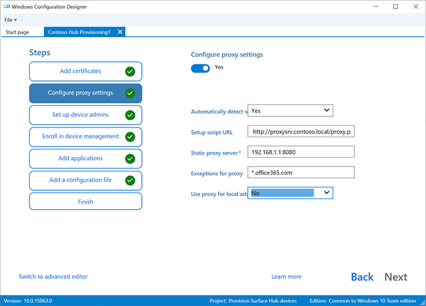

# <a name="create-provisioning-packages-for-surface-hub"></a>Создание пакетов подготовки для Surface Hub

Пакеты подготовка позволяют автоматизировать развертывание ключевых функций, помогая обеспечить согласованную функцию во всех центрах surface в вашей организации.  Используя Windows (WCD) на отдельном компьютере, вы можете выполнить следующие задачи:

- Регистрация в Active Directory или Azure Active Directory
- Создание учетной записи администратора устройства
- добавить приложения и сертификаты;
- настроить параметры прокси-сервера;
- добавить файл конфигурации Surface Hub.
- Настройка [параметров поставщика служб конфигурации (CSP)](/windows/client-management/mdm/surfacehub-csp)

## <a name="overview"></a>Обзор

1. На отдельном компьютере с Windows 10 установите [Windows конструктор конфигурации](https://www.microsoft.com/store/apps/9nblggh4tx22) из Microsoft Store.
1. Выберите [**Surface Hub для**](#use-surface-hub-provisioning-wizard) настройки общих параметров с помощью мастера. Или выберите [advanced provisioning](#use-advanced-provisioning) для просмотра и настройки всех возможных параметров.
1. Создайте пакет подготовка и сохраните его на USB-диске.
1. Развертывание пакета в Surface Hub во время установки первого запуска или через Параметры приложение. Дополнительные дополнительные возможности см. [в см. в пункте Создание](/windows/configuration/provisioning-packages/provisioning-create-package)пакета подготовка для Windows 10.

## <a name="use-surface-hub-provisioning-wizard"></a>Используйте мастер Surface Hub подготовка

1. Откройте Windows и выберите **устройства Provision Surface Hub.**<br>
    
    
2. Назови свой проект и выберите **Далее**.

### <a name="add-certificates"></a>Добавление сертификатов

> [!div class="mx-imgBorder"]
> 

Для предоставления устройства сертификата выберите **Добавить сертификат.** Введите имя сертификата и выберите используемый сертификат.  Дополнительные параметры обеспечения см. в разделе [Добавление сертификата в пакет.](#add-a-certificate-to-your-package)

### <a name="configure-proxy-settings"></a>настроить параметры прокси-сервера;

> [!div class="mx-imgBorder"]
> 

1. Выберите **Да** или **Нет** для параметров прокси-сервера. По умолчанию Surface Hub автоматически обнаруживает параметры прокси. Тем не менее, если ранее инфраструктура требовала использование прокси-сервера, но теперь этого не требует, можно восстановить параметры по умолчанию для устройств Surface Hub с помощью пакета подготовки. Для этого выберите **Да** и **Автоматически определять параметры**.
2. Если вы переключение **Да,** вы можете выбрать для автоматического обнаружения параметров прокси или вручную настроить параметры, введите один из следующих:

    - URL-адрес сценария установки.
    - Статичный адрес прокси-сервера и сведения о порту.

3. Если вы собираетесь использовать сценарий установки или прокси-сервер, отключите **параметры автоматического обнаружения.** Вы можете использовать сценарий установки *или* прокси-сервер, а не оба.
4. Введите исключения (адреса, к Surface Hub должны подключаться напрямую без использования прокси-сервера). **Пример:** *.office365.com
5. Определите, следует ли использовать прокси-сервер для локальных адресов.

### <a name="set-up-device-admins"></a>Настройка администраторов устройств

 > [!div class="mx-imgBorder"]
 > 

Можно зарегистрировать устройство в Active Directory и указать группу безопасности, чтобы использовать приложение «Параметры», зарегистрироваться в Azure Active Directory, чтобы разрешить глобальным администраторам использовать приложение «Параметры», или создать учетную запись локального администратора на устройстве.

1. Для регистрации устройства в Active Directory введите учетные данные для учетной записи пользователя с минимальными правами, чтобы подключить устройство к домену, и укажите группу безопасности, чтобы использовать учетные данные администратора на Surface Hub. При применении пакета к Surface Hub, которая была сброшена, можно использовать ту же учетную запись домена до тех пор, пока это та же учетная запись, которая Surface Hub изначально. В противном случае необходимо использовать другую учетную запись домена в пакете подготовки.
2. Прежде чем использовать Windows для настройки массовой регистрации Azure AD, запланируйте реализацию реализации [реализации azure AD.](/azure/active-directory/devices/azureadjoin-plan) Параметр **Максимальное количество устройств на одного пользователя** в клиенте Azure AD определяет, сколько раз можно использовать массовый маркер, полученный в мастере.
3. Для регистрации устройства в Azure AD, выберите соответствующий вариант и введите понятное имя для массового маркера, полученного с помощью мастера. Задайте дату окончания срока действия маркера (максимальное значение — 30 дней с даты получения маркера). Выберите **маркер Get bulk**. В окне **Выполнение входа в систему** введите учетную запись с разрешениями для присоединения устройства к Azure AD и пароль. Выберите **Accept,** чтобы Windows конструктору конфигурации необходимые разрешения.
4. Чтобы создать учетную запись локального администратора, выберите соответствующий параметр и введите имя пользователя и пароль.

> [!IMPORTANT]
> Если вы создаете локальную учетную запись в пакете подготовки, необходимо изменять пароль с помощью приложения **Параметры** один раз в каждые 42 дня. Если пароль не меняется в течение этого периода, учетная запись может быть заблокирована и стать недоступной для входа.

### <a name="enroll-in-third-party-mdm-provider"></a>Регистрация в стороном поставщике MDM

> [!div class="mx-imgBorder"]
> 

Если используется сторонний поставщик управления мобильными устройствами (MDM), этот раздел можно использовать для регистрации Surface Hub. Чтобы зарегистрироваться в Intune, сначала установите Azure AD, как описано в предыдущем разделе, и [](/mem/intune/enrollment/quickstart-setup-auto-enrollment)следуйте инструкциям в следующей документации Intune: Настройка автоматической регистрации для Windows 10 устройств .

1. Toggle **Да** или **Нет** для регистрации в сторонних MDM.
2. Если вы переначислили **да,** укажите учетную запись службы и пароль или отпечатки пальцев сертификата, которые уполномочены зарегистрировать устройство и указать тип проверки подлинности.
3. Если требуется поставщик MDM, введите URL-адреса для службы обнаружения, службы регистрации и службы политики.

 Дополнительные дополнительные Surface Hub с поставщиком [MDM.](manage-settings-with-mdm-for-surface-hub.md)

### <a name="add-applications"></a>Добавление приложений

> [!div class="mx-imgBorder"]
> 

В пакете подготовки можно установить несколько приложений универсальной платформы Windows (UWP). Дополнительные дополнительные ссылки см. [в пункте Provision PCs с приложениями.](/windows/configuration/provisioning-packages/provision-pcs-with-apps)

> [!NOTE]
> Хотя Windows конструктор конфигурации позволяет добавить классическое приложение Win32 в пакет подготовка, Surface Hub принимает только приложения UWP. Если включить классическое приложение Win32, подготовка завершится ошибкой.

### <a name="add-a-configuration-file"></a>Добавление файла конфигурации

В дополнение к этому пакету подготовка можно использовать Surface Hub конфигурации, чтобы упростить настройку устройств. Файл Surface Hub конфигурации содержит список учетных записей устройств для подключения к Exchange, Microsoft Teams или Skype для бизнеса, а также "дружественные имена" для беспроводной проекции.

**Создание файла Surface Hub конфигурации:**

1. Откройте Microsoft Excel (или другой редактор .csv), создайте файл .csv с _именемSurfaceHubConfiguration.csv_.

2. Введите список учетных записей устройств и дружественных имен в этом формате:

    ```
    <DeviceAccountName>,<DeviceAccountPassword>,<FriendlyName>
    ```

    > [!NOTE]
    > Файл конфигурации не должен содержать заголовки столбцов. Если он включен в пакет Surface Hub, вы можете выбрать учетную запись и удобное имя устройства из файла. Чтобы создать файл .csv, используйте формат адресов UPN (rainier@contoso.com) или формат имен логотипа на уровне вниз (contoso\rainier).

    rainier@contoso.com,password,Rainier Surface Hub

3. Сохраните файл в папке проекта и скопируйте его в USB-ключ с помощью пакета предварительного обеспечения.

> [!NOTE]
> Файл конфигурации может применяться только при первом запуске.

### <a name="password-protect-provisioning-package"></a>Пакет защиты паролей

Если вы решите использовать пароль, вам нужно будет вводить его каждый раз, когда вы применяли пакет подготовка к устройству.

### <a name="complete-provisioning-wizard"></a>Мастер полной провизии

Если требуется только настроить общие параметры, выберите **Finish**Create и  >  **** переехав в раздел [Сборка пакета](#build-your-package). Или продолжить настройку параметров, перейдя на предварительную настройку.

## <a name="use-advanced-provisioning"></a>Использование advanced provisioning

> [!TIP]
> Используйте мастер, чтобы создать пакет с общими параметрами, затем переключитесь в расширенный редактор, чтобы добавить другие параметры.<br><br> 

1. Если вы продолжите работу в предыдущем разделе, выберите **Переключатель** на расширенный редактор в противном случае **откройте Windows конструктор** конфигурации и выберите **advanced provisioning**.

   

2. Назови свой проект и выберите **Далее**.

3. Выберите **общие для Windows 10 для совместной работы,** выберите **Далее**, а затем выберите **Готово**.

   

4. В проекте в **рамках доступных настроек**выберите **параметры Common Team.**

   :::image type="content" alt-text="Общие параметры WCD." source="images/icd-common-settings.png":::

### <a name="add-a-certificate-to-your-package"></a>Добавление сертификата в пакет

Пакеты подготовки можно использовать для установки сертификатов, которые позволяют устройству проходить проверку подлинности в Microsoft Exchange.

> [!NOTE]
> Пакеты подготовки позволяют установить сертификаты только в хранилище устройства (на локальном компьютере), а не в хранилище пользователя. Если вашей организации требуется установить сертификаты в хранилище пользователей, используйте приложение **** Hub **Параметры:** Обновление сертификатов безопасности &  >  ****  >  **** безопасности.
Кроме того, можно использовать  [**политики MDM**](manage-settings-with-mdm-for-surface-hub.md) для развертывания сертификатов в магазине устройств или в магазине пользователей.

> [!TIP]
> Раздел ClientCertificates для файлов .pfx с закрытым ключом; .cer-файлы для корневых CAs должны быть размещены в разделе **RootCertificates,** а промежуточные CAs в **разделе CACertificates.** ****

1. В **Windows Конструктор конфигурации**Доступные настройки, перейдите к параметрам  >  **** **runtime**  >  **Сертификаты**  >  **ClientCertificates**.
2. Введите метку **для CertificateName и** выберите **Добавить**.
3. Введите **CertificatePassword**.
4. Найдите и выберите сертификат, который следует использовать для **CertificatePath**.
5. Задайте значение **False** для параметра **ExportCertificate**.
6. Для параметра **KeyLocation** выберите значение **Только программное обеспечение**.

### <a name="add-a-uwp-app-to-your-package"></a>Добавление приложения UWP в пакет

Чтобы добавить приложение UWP в пакет подготовка, вам потребуется пакет приложений (.appx или .appxbundle files) и все файлы зависимостей. Если вы приобрели приложение в Microsoft Store для бизнеса, вам также потребуется *некодированная* лицензия на приложение. Информацию о загрузке этих элементов из Microsoft Store для бизнеса см. в статье [Распространение автономных приложений](/microsoft-store/distribute-offline-apps).

**Чтобы добавить приложение UWP:**

1. На панели **Доступные настройки** перейдите в раздел **Параметры среды выполнения** > **UniversalAppInstall** > **DeviceContextApp**.

2. Введите **имя PackageFamilyName** для приложения и выберите **Добавить**. Для согласованности используйте имя семейства пакетов приложения. Если вы приобрели приложение в Microsoft Store для бизнеса, найти имя семейства пакетов можно в лицензии на приложение. Откройте файл лицензии с помощью текстового редактора и используйте значение между тегами PFM.

3. Для **ApplicationFile**выберите **Обзор,** чтобы найти и выбрать целевое приложение (appx или appxbundle).

4. Для **DependencyAppxFiles**выберите **Просмотр,** чтобы найти и добавить все зависимости для приложения. Для Surface Hub потребуются только версии x64 этих зависимостей.

Если вы приобрели приложение из Microsoft Store для бизнеса, вам потребуется добавить лицензию приложения в пакет подготовка.

**Чтобы добавить лицензию приложения:**

1. Создайте копию лицензии на приложение и переименуйте ее с расширением **.ms-windows-store-license**. Например, переименуем example.xml "example.ms-windows-store-license".

2. В Windows конструктор конфигурации **** перейдите к доступным настройкам  >  **параметров runtime**  >  **UniversalAppInstall**  >  **DeviceContextAppLicense.**

3. Введите **LicenseProductId** и выберите **Добавить**. Для согласованности используйте идентификатор лицензии приложения из лицензии на приложение. Откройте файл лицензии в текстовом редакторе. Затем в **теге Лицензия** используйте значение **атрибута LicenseID.**

4. Выберите новый узел **LicenseProductId**. Для **LicenseInstall**выберите **Просмотр,** чтобы найти и выбрать переименованный файл лицензии (example.ms-windows-store-license).

### <a name="add-a-policy-to-your-package"></a>Добавление политики в пакет

Surface Hub поддерживает подмножество политик в разделе [Поставщик служб конфигурации политик](/windows/client-management/mdm/policy-configuration-service-provider). Некоторые из этих политик можно настроить с помощью Windows Configuration Designer.

 **Добавление [политик CSP:](/windows/client-management/mdm/policies-in-policy-csp-supported-by-surface-hub)**

1. Перейдите **к доступным настройкам**  >  **Политики параметров**времени  >  **работы.**
2. Выберите компонент, который необходимо управлять и настроить параметр политики по мере необходимости. Например, чтобы сотрудники не использовали веб-сайт InPrivate в Surface Hub, выберите **AllowInPrivate** и выберите **Disable**.  

   :::image type="content" alt-text="Настройка параметра политики." source="images/sh-prov-policies.png" lightbox="images/sh-prov-policies.png":::

### <a name="add-surface-hub-settings-to-your-package"></a>Добавление параметров Surface Hub в пакет

В пакет подготовки можно добавить параметры из раздела [Поставщик служб конфигурации SurfaceHub](/windows/client-management/mdm/surfacehub-csp).

1. Перейдите **к доступным настройкам**  >  **Common Team Edition Параметры**.
1. Выберите компонент, который необходимо управлять и настроить параметр политики по мере необходимости.
1. Когда вы закончили настройку пакета подготовка, выберите **файл**  >  **Сохранить**.
1. Ознакомьтесь с предупреждением о том, что файлы проекта могут содержать конфиденциальные сведения, и выберите **ОК**

### <a name="build-your-package"></a>Сборка пакета

При создании пакета подготовки вы можете включить конфиденциальную информацию в файлы проекта и в файл пакета подготовки (PPKG). Несмотря на то что у вас есть возможность шифрования PPKG-файла, файлы проекта не шифруются.  Храните файлы проекта в безопасном расположении или удалите, если они больше не нужны.

1. Откройте **пакет Windows**  >  **конструктора**  >  **конфигурации.**

2. Изменение **владельца на** **ИТ-администратора**.  

3. Установите значение для параметра **Версия пакета**, а затем нажмите кнопку **Далее.**

   > [!TIP]
   > Настройка владельца для ИТ-администратора гарантирует, что параметры пакета поддерживают соответствующие "свойства приоритета" и остаются в силе Surface Hub, если другие пакеты провизии впоследствии применяются из других источников.

   > [!TIP]
   > Можно изменить существующие пакеты и изменить номер версии для обновления ранее примененных пакетов.

4. Необязательный. Вы можете зашифровать пакет и включить подписание пакета:

    1. Выберите **пакет Encrypt и** введите пароль.
    1. Выберите **пакет Sign**  >  **Просмотр** и выберите сертификат по мере необходимости.

    > [!IMPORTANT]
    > Рекомендуется включить надежный сертификат провизии в пакете подготовка. Когда пакет применяется к устройству, сертификат добавляется в системный магазин, что позволяет применять последующие пакеты молча.

5. Выберите **Далее,** чтобы указать расположение вывода. По умолчанию конструктор конфигураций Windows использует в качестве расположения выходных данных папку проекта. Или выберите **Просмотр,** чтобы изменить расположение вывода по умолчанию. Выберите **Далее**.

6. Выберите **Сборку,** чтобы приступить к созданию пакета. Сведения о проекте отображаются на странице сборки.

7. Если сборка не удается, появляется сообщение об ошибке со ссылкой на папку проекта. Просмотрите журналы, чтобы диагностировать ошибку, и попробуйте снова сделать пакет.

8. Если сборка будет успешной, будет отображаться имя пакета обеспечения, каталога выходных данных и каталога проектов. Выберите **Готово,** чтобы закрыть мастер и вернуться на страницу Настройки.

9. Выберите  **расположение вывода,**  чтобы перейти к расположению пакета. Копируйте PPKG-файл на пустой USB-накопитель флэш-памяти.

## <a name="apply-a-provisioning-package-to-surface-hub"></a>Применение пакета подготовки на устройстве Surface Hub

Существует два способа развертывания пакетов подготовка к Surface Hub:

- [Настройка первого запуска.](#apply-a-provisioning-package-during-first-run) Вы можете применить пакет подготовка для настройки нескольких параметров, включая параметры Wi-Fi, параметры прокси, сведения об учетной записи устройства, присоединиться к Azure AD и связанные параметры.  
- [Параметры приложение.](#apply-a-provisioning-package-using-settings-app) После первого запуска можно применить пакет предварительной Параметры приложения. 

### <a name="apply-a-provisioning-package-during-first-run"></a>Применение пакета подготовки при первом запуске

1. При первом включите Surface Hub, первая программа отображает страницу [**Привет там**](first-run-program-surface-hub.md). Перед продолжением убедитесь, что параметры настроены правильно.

2. Вставьте USB-устройство флэш-памяти с PPKG-файлом в Surface Hub. Если пакет находится в корневом каталоге диска, программа первого запуска распознает его и спросит, требуется ли настроить устройство. Выберите **Настройка**.

3. На следующем экране появляется запрос о выборе источника подготовки. Выберите **Съемный носитель** и коснитесь **Далее**.

4. Выберите пакет подготовка (*.ppkg), который необходимо применить, и нажмите **кнопку Далее**. Обратите внимание, что вы можете установить только один пакет во время первого запуска.

5. В программе первого запуска отобразится сводка изменений, которые будут внесены с помощью пакета подготовки. Выберите **Да, добавить**.

6. Если файл конфигурации включен в корневой каталог USB-накопителя, вы увидите параметр **Выбор конфигурации**. Первая учетная запись устройства в файле конфигурации будет отображаться вместе со сводными данными учетной записи, которые будут применяться к Surface Hub.

7. В **Выберите конфигурацию**выберите имя устройства для применения, а затем выберите **Далее**.

К устройству будут применены параметры из пакета подготовки и первый запуск будет завершен. После перезагрузки устройства можно удалить USB-накопитель.

### <a name="apply-a-provisioning-package-using-settings-app"></a>Применение пакета подготовка с помощью Параметры приложения

1. Вставьте USB-устройство флэш-памяти с PPKG-файлом в Surface Hub.
2. Начиная Surface Hub, **Параметры** введите учетные данные администратора при запросе.
3. Перейдите к **Surface Hub** > **Управление устройствами**. В **соответствии с пакетами подготовка**выберите Добавить или **удалить**пакет подготовка  >  **Добавить пакет**.
4. Выберите пакет подготовки и щелкните **Добавить**.  При запросе введите учетные данные администратора еще раз.
5. Вы увидите сводку изменений, которые необходимо применить. Выберите **Да, добавить**.

## <a name="learn-more"></a>Подробнее

- [Загрузка Windows конструктора конфигурации](https://www.microsoft.com/store/apps/9nblggh4tx22)
- [Создание пакета подготовки для Windows 10](/windows/configuration/provisioning-packages/provisioning-create-package)
- [Управление Surface Hub с помощью поставщика MDM](manage-settings-with-mdm-for-surface-hub.md)
