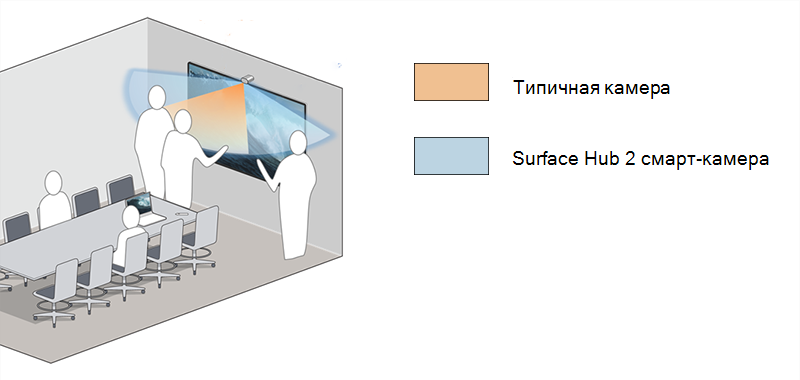

# Установка смарт-камеры Surface Hub 2 и управление ими

Surface Hub 2 Smart Camera1 предназначена для гибридных команд и оптимизирована для удаленных участников. Благодаря фокусу на переднем плане и фоне удаленные участники могут видеть, как пользователи взаимодействуют с содержимым на Surface Hub, а также просматривать других участников в комнате. Surface Hub 2 Smart Camera имеет широкое поле обзора, превышаемое 136 градусов, автоматическое обрамляние, высококачественную оптику стекол и датчик низкого освещения.

*Ультра-широкое представление камеры включает в себя доску людей на крайних краях 85-значного концентратора*

## Системные требования

Для устройств Surface Hub под управлением ОС группы Surface Hub 2 Smart Camera требуется следующее обновление для обновления [Windows 10 для совместной работы 2020](surface-hub-2020-update-whats-new.md) (20H2) на Surface Hub 2:

- Windows 10 для совместной работы 2020 с обновлением 2 (KB5010415 или Windows обновления)
- Обновление системного оборудования — 21.01.2022 (или последующее обновление системного оборудования)

Дополнительные сведения см[. в Surface Hub обновлений](surface-hub-update-history.md).

> [!NOTE]
> Для переноса Устройств Surface Hub для запуска Windows 10 или Windows 11 Pro/Enterprise не требуется никаких дополнительных обновлений.

## Установка смарт-камеры

1. Присоедините камеру к порту USB-C в середине Surface Hub 2. Индикатор индикатора будет мигать на короткое время, когда камера подключена и постоянно используется при использовании камеры.

     

2. Чтобы удалить камеру, вытяните вверх и вперед. Магнитный поток предотвращает отключение или извлечение камеры назад.

    

> [!TIP]
> Камера прикрепывается к передней части для обеспечения конфиденциальности, а обратная — к хранилищу, если она не используется.

## Управление параметрами автоматического кадрирования

Автоматическое изменение кадрирования динамически масштабирует и удерживает вас в центре видео при перемещении. Способ управления параметрами зависит от операционной системы, установленной на Surface Hub:

- [Windows 10 для совместной работы 2020 (20H2)](#windows-10-team-2020-update-20h2)
- [Windows 11 Desktop на Surface Hub](#windows-11-desktop-on-surface-hub)
- [Windows 10 Desktop на Surface Hub](#windows-10-desktop-on-surface-hub)

### Windows 10 для совместной работы 2020 (20H2)

При установке Surface Hub Smart Camera автоматическое кадрирование включено по умолчанию. Администраторы могут управлять автоматическим кадрированием из Параметры с помощью переключателя "Вкл./Выкл.", который задает состояние автоматического кадрирования в начале каждого Surface Hub сеанса.

**Чтобы настроить автоматическое кадрирование:**

1. На Surface Hub 2S войдите в систему от имени **администратора**.

> [!NOTE]
> Если вы не знаете имя пользователя или пароль администратора, необходимо сбросить устройство. Дополнительные сведения см. в разделе ["Сброс и восстановление для Surface Hub 2S"](/surface-hub/surface-hub-2s-recover-reset).

2. Откройте **Параметры** и перейдите к Surface Hub > **вызов & Audio.**
3. В **разделе "Автоматическое кадрирование**" настройте переключатель соответствующим образом. 
4. Выберите **"Завершить сеанс"**; При запуске нового сеанса применяются измененные параметры. 

Если переключатель имеет значение **"Включено**", автоматическое кадрирование всегда будет включено по умолчанию, когда пользователи начинают сеанс Surface Hub. Если переключатель имеет значение **Off**, автоматическое кадрирование всегда будет отключено по умолчанию при запуске сеанса Surface Hub.

#### Управление параметрами камеры с помощью поставщика MDM

Администраторы могут управлять автоматическим кадрированием с помощью [поставщика](/windows/client-management/mdm/surfacehub-csp) Surface Hub конфигурации (CSP) от Intune или стороннего поставщика управления мобильными устройствами (MDM).

|Параметр политики CSP| Описание|
|------------------|------------|
|DefaultAutomaticFraming|Если этот параметр политики включен, автоматическое кадрирование включено. Если отключить этот параметр политики, автоматическое кадрирование будет отключено. Если этот параметр политики не настроен, автоматическое кадрирование включено. |

Дополнительные сведения см. в следующих разделах:

- [Управление параметрами с помощью поставщика MDM](/surface-hub/manage-settings-with-mdm-for-surface-hub#create-custom-configuration-profile)
- [Поставщик служб конфигурации SurfaceHub — Windows управления клиентами](/windows/client-management/mdm/surfacehub-csp)

### Windows 11 Desktop на Surface Hub

Если [вы перенесите](surface-hub-2s-migrate-os.md) Surface Hub для запуска Windows 11 Pro или Windows 11 Корпоративная, необходимо включить автоматическое кадрирование для Surface Hub Smart Camera. По умолчанию автоматическое кадрирование отключено.

Чтобы включить автоматическое кадрирование, перейдите к Параметры > Bluetooth & устройств > управления камерами> Surface Hub **2 Smart Camera.**

### Windows 10 Desktop на Surface Hub

Автоматическое кадрирование всегда включено и не может быть отключено или иным образом настроено.

## Порядок Surface Hub 2 смарт-камеры

Приобретите Surface Hub 2 смарт-камеры у авторизованного торгового [посредника Microsoft Surface](https://www.microsoft.com/surface/business/where-to-buy-microsoft-surface?).

### Ссылки

1. Surface Hub 2 Смарт-камера, проданная отдельно с 16 марта 2022 г., динамически настраивает видеопоток для удаленных участников. Surface Hub 2 Smart Camera будет включен в поле с Surface Hub 2S 85", начиная с мая 2022 г.
