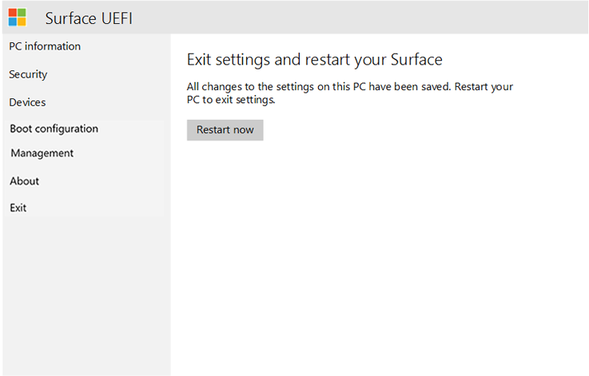

# Управление параметрами UEFI SurfaceManage Surface UEFI settings

Во всех текущих и будущих поколениях Surface Devices используется уникальный унифицированный интерфейс микропрограмм (UEFI), разработанный корпорацией Майкрософт для этих устройств.All current and future generations of Surface devices use a unique Unified Extensible Firmware Interface (UEFI) engineered by Microsoft specifically for these devices. Параметры UEFI Surface предоставляют возможность включать или отключать встроенные устройства и компоненты, защищать параметры UEFI от изменения и настраивать параметры загрузки устройства Surface.Surface UEFI settings provide the ability to enable or disable built-in devices and components, protect UEFI settings from being changed, and adjust the Surface device boot settings. 

## Поддерживаемые продуктыSupported products

Управление UEFI поддерживается в следующих случаях:UEFI management is supported on the following: 

- Surface Pro 4, Surface Pro (5-го поколения), Surface Pro 6, Surface Pro 7, Surface Pro XSurface Pro 4, Surface Pro (5th Gen), Surface Pro 6, Surface Pro 7, Surface Pro X
- Surface ноутбук (1-го), Surface (поверхность 2, ноутбук 3, поверхность для портативного компьютера)Surface Laptop (1st Gen), Surface Laptop 2, Surface Laptop 3, Surface Laptop Go
- Surface Studio (1-го поколения), Surface Studio 2Surface Studio (1st Gen), Surface Studio 2
- Surface Book, Surface Book 2, Surface Book 3Surface Book, Surface Book 2, Surface Book 3
- Surface Go, Surface Go 2Surface Go, Surface Go 2

## Поддержка управления на основе облакаSupport for cloud-based management

С помощью интерфейса конфигурации встроенного по устройства (DFCI), встроенного в Microsoft Intune (теперь доступно в общедоступном предварительном просмотре), управление UEFI Surface расширяет современный стек управления до уровня оборудования UEFI.With Device Firmware Configuration Interface (DFCI) profiles built into Microsoft Intune (now available in public preview), Surface UEFI management extends the modern management stack down to the UEFI hardware level. DFCI поддерживает подготовку от нуля, исключаются пароли BIOS, обеспечивает управление параметрами безопасности, включая параметры загрузки и встроенные периферийные устройства, а также предлагает фундамент для более сложных сценариев безопасности в будущем.DFCI supports zero-touch provisioning, eliminates BIOS passwords, provides control of security settings including boot options and built-in peripherals, and lays the groundwork for advanced security scenarios in the future. DFCI в настоящее время доступно для Surface Pro 7, Surface Pro X и Surface 3.DFCI is currently available for Surface Pro 7, Surface Pro X, and Surface Laptop 3. Дополнительные сведения можно найти в разделе [Управление параметрами UEFI Surface в Intune](surface-manage-dfci-guide.md).For more information, refer to [Intune management of Surface UEFI settings](surface-manage-dfci-guide.md).

## Открытие меню UEFI SurfaceOpen Surface UEFI menu

Чтобы настроить параметры UEFI во время запуска системы, выполните указанные ниже действия.To adjust UEFI settings during system startup:

1. Завершите работу своей поверхности и подождите около 10 секунд, чтобы убедиться, что она отключена.Shut down your Surface and wait about 10 seconds to make sure it's off.
2. Нажмите и удерживайте кнопку " **Громкость** " и нажимайте и отпустите **кнопку Power.**Press and hold the **Volume-up** button  and - at the same time - press and release the **Power button.**
3. По мере появления логотипа Microsoft или Surface на экране продолжайте навести кнопку " **Громкость** ", пока не появится экран UEFI.As the Microsoft or Surface logo appears on your screen, continue to hold the **Volume-up** button until the UEFI screen appears.

## Страница сведений о компьютере UEFIUEFI PC information page

На странице сведения о компьютере содержатся подробные сведения о вашем устройстве Surface.The PC information page includes detailed information about your Surface device: 

- **Model (модель** ) — на этой странице будет показана модель устройства Surface, например Surface Book 2 или Surface Pro 7.**Model** – Your Surface device’s model will be displayed here, such as Surface Book 2 or Surface Pro 7. Точная конфигурация устройства (например, процессор, размер диска или объем памяти) не отображается.The exact configuration of your device is not shown, (such as processor, disk size, or memory size). 
- **UUID**: уникальный идентификатор устройства, который используется для идентификации устройства во время разработки и управления.**UUID** – This Universally Unique Identification number is specific to your device and is used to identify the device during deployment or management. 

- **Serial Number**: этот номер используется для идентификации устройства Surface во время инвентаризации и поддержки.**Serial Number** – This number is used to identify this specific Surface device for asset tagging and support scenarios.
- **Asset Tag**: тег актива назначается устройству Surface с помощью [средства Asset Tag](https://docs.microsoft.com/surface/assettag).**Asset Tag** – The asset tag is assigned to the Surface device with the [Asset Tag Tool](https://docs.microsoft.com/surface/assettag). 

Кроме того, в этом разделе вы найдете подробные сведения о встроенном ПО устройства Surface.You will also find detailed information about the firmware of your Surface device. Устройства Surface включают несколько внутренних компонентов, работающих под управлением разных версий встроенного ПО.Surface devices have several internal components that each run different versions of firmware. Версия встроенного ПО каждого из перечисленных ниже устройств отображается на странице **PC information** (как показано на рис. 1):The firmware version of each of the following devices is displayed on the **PC information** page (as shown in Figure 1): 

- UEFI системы;System UEFI 

- контроллер SAM;SAM Controller 

- модуль управления Intel;Intel Management Engine 

- встроенный контроллер системы;System Embedded Controller 

- встроенное ПО сенсорного управления.Touch Firmware 

*Рис. 1.Figure 1. Сведения о системе и версии встроенного ПОSystem information and firmware version information*

Вы можете найти актуальные сведения о последней версии встроенного ПО для вашего устройства Surface в [журнале обновлений Surface](https://www.microsoft.com/surface/support/install-update-activate/surface-update-history) для этого устройства.You can find up-to-date information about the latest firmware version for your Surface device in the [Surface Update History](https://www.microsoft.com/surface/support/install-update-activate/surface-update-history) for your device. 

## Страница безопасности UEFIUEFI Security page 

*Рисунок 2.Figure 2. Настройка параметров безопасности UEFI SurfaceConfigure Surface UEFI security settings*

На странице "безопасность" можно установить пароль для защиты параметров UEFI.The Security page allows you to set a password to protect UEFI settings. Этот пароль необходимо ввести при загрузке устройства Surface в режиме UEFI.This password must be entered when you boot the Surface device to UEFI. Пароль может содержать следующие символы (как показано на рис. 3).The password can contain the following characters (as shown in Figure 3): 

- Прописные буквы: A–ZUppercase letters: A-Z 

- Строчные буквы: a–zLowercase letters: a-z 

- Цифры: 1–10Numbers: 1-0 

- Специальные символы:! @ # $% ^& \* ()? <>{} []-_ = + |.,;: ' ".Special characters: !@#$%^&\*()?<>{}[]-_=+|.,;:’\`” 

Пароль должен состоять по крайней мере из 6 символов и вводится с учетом регистра.The password must be at least 6 characters and is case sensitive. 

*Рисунок 3.Figure 3. Добавление пароля для защиты параметров UEFI SurfaceAdd a password to protect Surface UEFI settings*

На странице Security также можно изменить конфигурацию безопасной загрузки устройства Surface.On the Security page you can also change the configuration of Secure Boot on your Surface device. Технология безопасной загрузки предотвращает загрузку несанкционированного кода на устройстве Surface, обеспечивая защиту от заражений буткитами и руткитами.Secure Boot technology prevents unauthorized boot code from booting on your Surface device, which protects against bootkit and rootkit-type malware infections. Вы можете отключить безопасную загрузку, чтобы на устройстве Surface можно было загружать сторонние операционные системы и загрузочные носители.You can disable Secure Boot to allow your Surface device to boot third-party operating systems or bootable media. Вы также можете настроить безопасную загрузку для работы со сторонними сертификатами, как показано на рисунке 4.You can also configure Secure Boot to work with third-party certificates, as shown in Figure 4. Дополнительные сведения о [безопасной загрузке](https://msdn.microsoft.com/windows/hardware/commercialize/manufacture/desktop/secure-boot-overview) см. в библиотеке TechNet.Read more about [Secure Boot](https://msdn.microsoft.com/windows/hardware/commercialize/manufacture/desktop/secure-boot-overview) in the TechNet Library.

*Рисунок 4.Figure 4. Настройка безопасной загрузкиConfigure Secure Boot*

В зависимости от устройства вы также можете проверить, включен ли доверенный платформенный модуль.Depending on your device, you may also be able to see if your TPM is enabled or disabled. Если вы не видите параметр **включить доверенный платформенный модуль**  , откройте TPM. msc в Windows, чтобы проверить состояние, как показано на рисунке 5.If you do not see the **Enable TPM**  setting, open tpm.msc in Windows to check the status, as shown in Figure 5. TPM используется для проверки подлинности при шифровании данных устройства с помощью BitLocker.The TPM is used to authenticate encryption for your device’s data with BitLocker. Дополнительные сведения можно найти в разделе [Общие сведения о BitLocker](https://docs.microsoft.com/windows/security/information-protection/bitlocker/bitlocker-overview).To learn more, see [BitLocker overview](https://docs.microsoft.com/windows/security/information-protection/bitlocker/bitlocker-overview). 

*Рисунок 5.Figure 5. Консоль TPMTPM console*

## Меню UEFI: устройстваUEFI menu: Devices 

На странице устройства вы можете включать и отключать определенные устройства и компоненты, в том числе:The Devices page allows you to  enable or disable specific devices and components including:

- порты док-станций и USB;Docking and USB Ports 

- разъем для карты MicroSD или SD;MicroSD or SD Card Slot 

- задняя камера;Rear Camera 

- лицевая камера;Front Camera 

- инфракрасная камера;Infrared (IR) Camera 

- Wi-Fi и Bluetooth;Wi-Fi and Bluetooth 

- встроенная аудиосистема (динамики и микрофон).Onboard Audio (Speakers and Microphone) 

У каждого устройства есть кнопка с ползунком, с помощью которой можно перейти в положение **вкл** (разрешено) или **выключено** (отключено), как показано на рисунке 6.Each device is listed with a slider button that you can move to **On** (enabled) or **Off** (disabled) position, as shown in Figure 6. 

*Рисунок 6.Figure 6. Включение и отключение устройствEnable and disable specific devices*

## Меню UEFI: Настройка загрузкиUEFI menu: Boot configuration 

На странице Конфигурация загрузки можно изменить порядок загрузочных устройств, а также включить или отключить загрузку следующих устройств:The Boot Configuration page allows you to change the order of your boot devices as well as enable or disable boot of the following devices: 

- диспетчер загрузки Windows;Windows Boot Manager 

- USB-накопитель;USB Storage 

- сеть PXE;PXE Network 

- внутренняя память.Internal Storage 

Вы можете мгновенно загрузить систему с определенного устройства или провести пальцем влево по этому устройству в списке.You can boot from a specific device immediately, or you can swipe left on that device’s entry in the list using the touchscreen. Вы также можете мгновенно загрузить систему на USB-устройство или USB-адаптер для Ethernet, когда устройство Surface отключено, одновременно нажав кнопки **уменьшения громкости** и **включения**.You can also boot immediately to a USB device or USB Ethernet adapter when the Surface device is powered off by pressing the **Volume Down** button and the **Power** button simultaneously. 

Чтобы заданный загрузочный заказ **вступил в силу**, необходимо установить параметр **включить альтернативную загрузку последовательности** , как показано на рисунке 7.For the specified boot order to take effect, you must set the **Enable Alternate Boot Sequence** option to **On**, as shown in Figure 7. 

*Рисунок 7.Figure 7. Настройка порядка загрузки для устройства SurfaceConfigure the boot order for your Surface device* 

Вы также можете включать и отключать поддержку IPv6 для PXE с помощью параметра **Enable IPv6 for PXE Network Boot**, например во время развертывания Windows с помощью PXE, если сервер PXE настроен только для IPv4.You can also turn on and off IPv6 support for PXE with the **Enable IPv6 for PXE Network Boot** option, for example when performing a Windows deployment using PXE where the PXE server is configured for IPv4 only.  

## Меню UEFI: УправлениеUEFI menu: Management
На странице управления можно управлять использованием средств управления UEFI с нулевым касанием и других функций на подходящих устройствах, в том числе Surface Pro 7, Surface Pro X и Surface 3.The Management page allows you to manage use of Zero Touch UEFI Management and other features on eligible devices including Surface Pro 7, Surface Pro X, and Surface Laptop 3.  

 *показанным на рисунке 8. Управление доступом к сенсорному управлению UEFI и другим функциям*Manage access to Zero Touch UEFI Management and other features](images/manage-surface-uefi-fig7a.png "Manage access to Zero Touch UEFI Management and other features")
*Figure 8. Manage access to Zero Touch UEFI Management and other features* 

Управление UEFI с нулевым сенсорным интерфейсом позволяет удаленно управлять параметрами UEFI с помощью профиля устройства в средстве настройки встроенного микрокода устройства (DFCI) в Intune.Zero Touch UEFI Management lets you remotely manage UEFI settings  by using a device profile within Intune called Device Firmware Configuration Interface (DFCI). Если вы не настраиваете этот параметр, возможность управления подходящими устройствами с помощью DFCI будет настроена как **готовая**.If you do not configure this setting, the ability to manage eligible devices with DFCI is set to **Ready**. Чтобы предотвратить DFCI, выберите вариант **отказаться от**использования.To prevent DFCI, select **Opt-Out**. 

> [!NOTE]
> Страница параметров управления UEFI и использование DFCI доступны только на Surface Pro 7, Surface Pro X и Surface 3.The UEFI Management settings page and use of DFCI is only available on Surface Pro 7, Surface Pro X, and Surface Laptop 3.  

Дополнительные сведения можно найти в разделе [Управление параметрами UEFI Surface в Intune](surface-manage-dfci-guide.md).For more information, refer to [Intune management of Surface UEFI settings](surface-manage-dfci-guide.md).

## Меню UEFI: выходUEFI menu: Exit 

Нажмите кнопку **Перезапустить сейчас** на странице **выхода** , чтобы выйти из параметров UEFI, как показано на рисунке 9.Use the **Restart Now** button on the **Exit** page to exit UEFI settings, as shown in Figure 9. 

*Рисунок 9.Figure 9. Нажмите "Restart Now", чтобы выйти из меню UEFI Surface и перезагрузить устройствоClick Restart Now to exit Surface UEFI and restart the device*

## Экраны загрузки UEFI SurfaceSurface UEFI boot screens

При обновлении встроенного ПО устройства Surface с помощью центра обновления Windows или ручной установки обновления применяются к устройству не сразу, а во время следующего цикла перезагрузки.When you update Surface device firmware, by using either Windows Update or manual installation, the updates are not applied immediately to the device, but instead during the next reboot cycle. Вы можете узнать больше о процессе обновления встроенного ПО Surface на странице [Управление обновлениями драйверов и встроенного ПО Surface](https://docs.microsoft.com/surface/manage-surface-pro-3-firmware-updates).You can find out more about the Surface firmware update process in [Manage Surface driver and firmware updates](https://docs.microsoft.com/surface/manage-surface-pro-3-firmware-updates). Выполнение обновления встроенного ПО отображается на экране с помощью индикаторов разных цветов, соответствующих встроенному ПО каждого компонента.The progress of the firmware update is displayed on a screen with progress bars of differing colors to indicate the firmware for each component. Индикатор выполнения каждого компонента показан на рисунках 9 – 18.Each component’s progress bar is shown in Figures 9 through 18.

*Рисунок 10.Figure 10. Обновление встроенного ПО UEFI Surface с синим индикатором выполненияThe Surface UEFI firmware update displays a blue progress bar*

*Рисунок 11.Figure 11. Обновление встроенного ПО встроенного контроллера системы с зеленым индикатором выполненияThe System Embedded Controller firmware update displays a green progress bar*

*Рисунок 12.Figure 12. Обновление встроенного ПО контроллера SAM с оранжевым индикатором выполненияThe SAM Controller firmware update displays an orange progress bar*

*Рисунок 13.Figure 13. Обновление встроенного ПО Intel Management Engine с красным индикатором выполненияThe Intel Management Engine firmware update displays a red progress bar*

*Рисунок 14.Figure 14. При обновлении встроенного ПО сенсорных элементов Surface отображается серый индикатор выполненияThe Surface touch firmware update displays a gray progress bar*

*Рис. 15.Figure 15. На индикаторе обновления встроенного микрокода Surface KIP отображается светло-зеленый индикатор выполненияThe Surface KIP firmware update displays a light green progress bar*

*Рисунок 16. Программа Surface ISH, на которой отображается индикатор прогрессаFigure 16 The Surface ISH firmware update displays a light pink progress bar*

*Рис. 17.Figure 17. В обновлении встроенного по Surface сенсорной панели отображается розовый индикатор выполненияThe Surface Trackpad firmware update displays a pink progress bar*

*Рисунок 18.Figure 18. В обновлении встроенного по Surface TCON отображается светлый серый индикатор выполненияThe Surface TCON firmware update displays a light gray progress bar*

*Рисунок 19.Figure 19. В обновлении встроенного по TPM Surface отображается фиолетовый индикатор выполненияThe Surface TPM firmware update displays a purple progress bar*

>[!NOTE]
>Появится дополнительное предупреждение с сообщением о том, что отключена безопасная загрузка, как показано на рисунке 19.An additional warning message that indicates Secure Boot is disabled is displayed, as shown in Figure 19.

*Рисунок 20.Figure 20. Экран загрузки Surface, указывающий, что безопасная загрузка отключена в параметрах UEFI SurfaceSurface boot screen that indicates Secure Boot has been disabled in Surface UEFI settings*

## Связанные темыRelated topics

- [Управление параметрами UEFI Surface в IntuneIntune management of Surface UEFI settings](surface-manage-dfci-guide.md)

-  [Surface Enterprise Management ModeSurface Enterprise Management Mode](surface-enterprise-management-mode.md)
