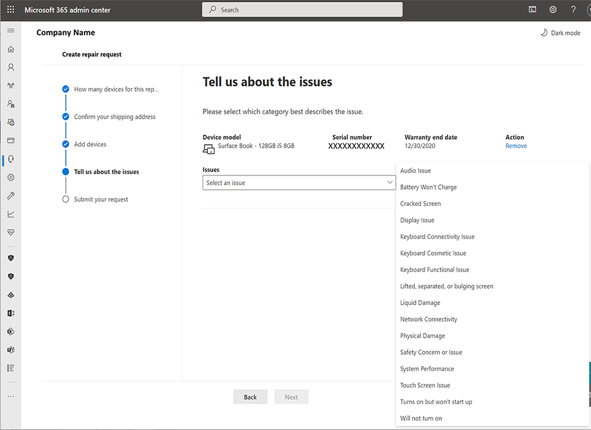

# Гарантия и обслуживание самообслуживаемой поверхности

Microsoft 365 Бизнес-клиенты могут иметь право использовать узел гарантии и службы Surface Self Serve в центре Microsoft 365 Admin для создания и управления заказами службы. Эта новая функция, доступная в качестве бета-программы, позволяет глобальным администраторам назначать разрешения лицам в их компании, ответственным за поддержку гарантий и утверждений о службе, включая:

- Upload серийные номера для устройств, требующих обслуживания.
- Добавьте несколько адресов доставки.
- Создание единого заказа службы для одного или многих устройств и типовых обложек.
- См. состояние заказа службы в режиме реального времени.
- Отправка и получение дополнительных Exchange отправки оптом, если устройства покрываются расширенной гарантией или расширенными Exchange были включены в состав покупки устройства.

## Регистрация бета-программы

Обратитесь к руководителю учетной записи успеха майкрософт или менеджеру по успеху клиентов, чтобы узнать больше об опыте и участии в бета-версии программы.

## Разрешения на основе ролей

Гарантия Self-Serve Surface позволяет глобальному администратору Microsoft 365 предоставлять различные разрешения на создание и управление заказами служб, назначая роли пользователям.

При добавлении Microsoft 365 в бета-программу дополнительные разрешения предоставляется следующим ролях администратора:

| Роль                  | Разрешения                                                                                                                         |
| --------------------- | ----------------------------------------------------------------------------------------------------------------------------------- |
| Глобальный администратор          | Просмотр запросов на ремонт Создание и управление запросами на ремонт Add/Edit/Delete Ship to Address(es) Создание и управление пользователями и их ролями |
| Администратор службы поддержки | Просмотр запросов на ремонт Создание и управление запросами на ремонт                                                                               |
| Администратор биллинга         | Просмотр запросов на ремонт Создание и управление запросами на ремонт Add/Edit/Delete Ship to address(es)                                        |

Дополнительные сведения о пользователях и разрешениях см. в [обзоре Центра администрирования Майкрософт.](/microsoft-365/admin/admin-overview/about-the-admin-center)

## Создание и управление заказом службы

1. Перейдите в центр Microsoft 365 Admin и [https://admin.microsoft.com](https://go.microsoft.com/fwlink/p/?linkid=2024339) войдите с соответствующими разрешениями администратора. Дополнительные новости [см. в Кто имеет разрешения администратора в моем бизнесе?](/microsoft-365/business-video/admin-center-overview#who-has-admin-permissions-in-my-business)
2. Перейдите **к**  >  **службе Поддержки ремонта поверхностных устройств** и выберите **Запрос на создание ремонта.** (Если вы не видите этот вариант ремонта, у вас нет разрешения на доступ к этой странице.)

    > [!div class="mx-imgBorder"]
    > 

3. Можно создать запрос на ремонт для одного или нескольких устройств. Выберите либо **отправить 1** устройство **** одновременно, либо отправить несколько устройств, чтобы использовать файл .csv для загрузки нескольких серийных номеров и выберите **Далее**.

    > [!NOTE]
    > **Для нескольких устройств:**
    >
    > - На странице Центр администрирования скачайте образец шаблона CSV, добавьте необходимые сведения и сохраните его на локальном диске.
    > - Выберите **Upload CSV-файл**для массовых записей, выберите файл .csv, сохраненный на локальном диске, и выберите **Open.**
    > - Серийные номера устройства будут загружаться. Выберите **Далее,** чтобы продолжить создание ремонта.

4. Под **заменой корабля выберите**адрес доставки. Или выберите **Добавить новый адрес.**

    > [!NOTE]
    >
    > - Разрешения позволяют некоторым администраторам добавлять новый корабль к адресам. Если у вас есть разрешения, > можно добавить новые адреса. Введите требуемую информацию и выберите  **Сохранить**.
    > - Форма автоматически проверяет сведения о адресе, и вы можете быть исправлены для внесения изменений, если адрес не распознается локальной почтовой системой. Адрес электронной почты используется для отправки уведомлений и сообщений для запроса на ремонт.

    > [!div class="mx-imgBorder"]
    > 

5. Добавьте устройство, введите серийный номер устройства в текстовом блоке. Дополнительные данные см. в [выпуске серийных номеров устройств.](https://support.microsoft.com/help/4036293/surface-find-the-serial-number-on-surface) Если серийный номер действителен, появится изображение и сведения о продукте, включая дату гарантии и номер модели. Выберите **Add Device,** если информация является правильной.

    > [!div class="mx-imgBorder"]
    > 

6. Повторите действия 1-2, чтобы добавить в запрос несколько устройств (до 20).
7. Из выпадаемого меню выберите тип проблемы, который лучше всего описывает проблему, и выберите **Далее.**

    > [!div class="mx-imgBorder"]
    > 

8. Просмотрите ваш заказ. Если какие-либо сведения некорректны, **выберите "Назад",** чтобы исправить ошибки.
9. Примите условия.
10. Если сводка запроса правильная, выберите **Отправить запрос**.

    > [!div class="mx-imgBorder"]
    > 

Когда домашняя страница отображается, вы можете просмотреть запрос на службу в сводный список и получить сообщение подтверждения.

## Вопросы и ответы

### Почему я получаю код ошибки 400 "Общая ошибка службы клиентов", 401 "Несанкционированная ошибка службы" или ошибка 403 "Ошибка запрещенной службы"?

Может возникнуть проблема с Microsoft 365 учетной записью или у пользователя нет разрешений на доступ к содержимому. За помощью можно связаться Microsoft 365 глобального администратора.

### Когда я вводю свой адрес доставки и получаю сообщение об ошибке, что нет предложений о доставке?

В настоящее время Self-Serve и бета-версия службы Surface имеет ограниченную доступность. Предложения будут доступны только в том случае, если адрес расположен в одной из следующих стран:

Австрия, Бахрейн, Бельгия, Болгария, Хорватия, Кипр, Чехия, Дания, Эстония, Финляндия, Франция, Германия, Греция, Венгрия, Ирландия, Италия, Кувейт, Латвия, Литва, Люксембург, Мальта, Нидерланды, Оман, Польша, Португалия, Румыния, Словакия, Словения, Южная Африка, Испания, Швеция и Великобритания (за исключением Северной Ирландии).

### Где можно увидеть заказы, размещенные на Microsoft 365 портале?

Перейдите [Центр администрирования Microsoft 365 - запросы службы](https://admin.microsoft.com/Adminportal/Home?source=applauncher#/support/devicerepairs) и войдите с Microsoft 365 учетными данными.

Заказы, созданные с помощью службы поддержки клиентов Майкрософт, не будут видны в модуле Self-Serve гарантии и управления службами.

### Почему я не могу добавить, изменить или удалить адрес доставки?

Возможность добавления, редактирования или удаления адреса доставки может выполняться только администратором глобальной Microsoft 365 или администратором биллинга. Обратиться к ним за помощью.  

### Как связаться с microsoft Support для бета-версии Self-Serve Surface и service?

Вы можете связаться с поддержкой непосредственно через модуль surface Support в Центре администрирования Майкрософт.

1. Вопишитесь в Центр администрирования Майкрософт с Microsoft 365 учетными данными.
2. Выберите **службу**поддержки  >  **surface Device Repairs > вам нужна помощь?** и опишите проблему.
3. Если результаты не помогают, выберите службу **поддержки контактов**и введите описание проблемы. Подтвердите свой контактный номер и адрес электронной почты, выберите предпочтительный метод контакта, а затем выберите **Связаться со мной**.
