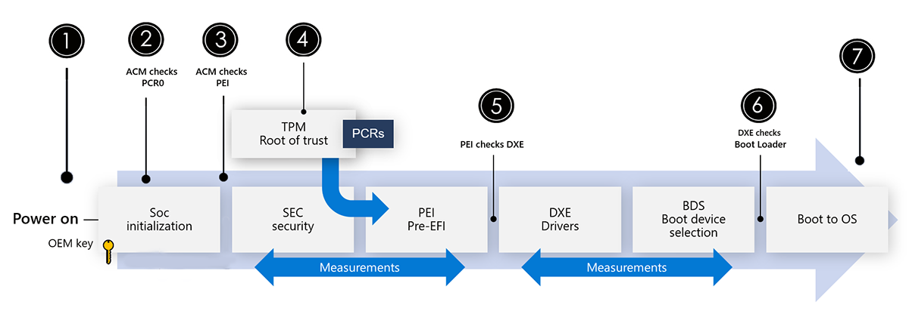

# Обзор безопасности surfaceSurface security overview

Недавние достижения в области исследований в области безопасности показывают, что по мере того, как в ОС и подключенные службы встроено больше средств защиты, злоумышленники ищут другие возможности эксплуатации с использованием прошивки, которая становится одной из главных целей.Recent advances in security research demonstrate that as more protections are built into the OS and connected services, attackers are looking for other avenues of exploitation with firmware emerging as a top target.

В настоящее время управление программным обеспечением устройств является несогласованным опытом и часто включает сторонних поставщиков, что затрудняет отслеживание и обслуживание прошивки.Today, managing device firmware is an inconsistent experience and often involves third-party providers making firmware difficult to monitor and complicated to maintain. В конечном счете это может ограничить возможности производителей оборудования обнаруживать и отжимать обновления в ответ на угрозы.Ultimately, this can limit the ability of hardware manufacturers to detect and push out timely updates in response to threats.

Microsoft Surface использует единый подход к защите от прошивки и безопасности устройств с 2015 г. благодаря комплексному владению разработкой оборудования, разработкой прошивки и комплексным подходом к обновлениям и управлению устройствами.Microsoft Surface has been using a unified approach to firmware protection and device security since 2015 through complete end-to-end ownership of the hardware design, in-house firmware development, and a holistic approach to device updates and management.

Для Surface наш объединенный extensible интерфейс прошивки (UEFI) 1 поддерживается в доме, регулярно обновляется через Windows Update и плавно развертывается для управления через Windows Автопилот, минимизируя риск и максимизируя контроль на уровне прошивки перед сапогами    устройства.For Surface, our Unified Extensible Firmware Interface (UEFI)[1](#references) is maintained in-house, regularly updated through Windows Update, and seamlessly deployed for management through Windows Autopilot, minimizing risk and maximizing control at the firmware level before the device boots. Корпорация Майкрософт обеспечивает полную прозрачность базы кода в нашем UEFI с помощью open Source [Project Mu](https://microsoft.github.io/mu/) на GitHub, управляемой Microsoft Endpoint Manager.Microsoft provides fully transparency of the code base in our UEFI through the Open Source [Project Mu](https://microsoft.github.io/mu/) on GitHub, managed by Microsoft Endpoint Manager.

## Разработанные и встроенные компоненты МайкрософтMicrosoft designed and built components

Каждый уровень Surface от чипа до облака разрабатывается и поддерживается Корпорацией Майкрософт, что дает вам максимальный контроль, проактивной защиты и душевного спокойствия, где бы и как бы ни была сделана работа.Every layer of Surface from chip to cloud is developed and maintained by Microsoft, giving you ultimate control, proactive protection, and peace of mind wherever and however work gets done. Устройства Surface отгружаются с самыми прочными протоколами безопасности, которые предлагает Корпорация Майкрософт, и позволяет оптимизировать управление, что снижает сложность ИТ-службы, что помогает пользователям сосредоточиться на своей работе.Surface devices ship with the strongest security protocols Microsoft offers and enables streamlined management that reduce IT complexity that helps users stay focused on their work.

Surface диски безопасности с помощью углубленного подхода к защите с помощью наслоения независимых защитных подкомпонентов.Surface drives security through a defense in-depth approach by utilizing a layering of independent defensive sub-components. От чипа до облака или UEFI, обеспечиваемого корнем доверия к AI-защитнику Microsoft Defender для конечной точки, который работает для предотвращения, обнаружения, расследования и реагирования на расширенные угрозы, Surface обеспечивает более эффективное положение, которое встроено в Microsoft.From chip to cloud, or a UEFI that ensures a Root of Trust to the AI powered Microsoft Defender for Endpoint that works to prevent, detect, investigate, and respond to advanced threats, Surface enforces the position that built-in from Microsoft is better than bolt-on.

| ФункцияFeature                         | ОписаниеDescription                                                                                                                                                                                                                                                                                                                         | ПодробнееLearn more                                                                                                                                                                   |
| ------------------------------- | ----------------------------------------------------------------------------------------------------------------------------------------------------------------------------------------------------------------------------------------------------------------------------------------------------------------------------------- | ---------------------------------------------------------------------------------------------------------------------------------------------------------------------------- |
| Microsoft Built UEFIMicrosoft Built UEFI            | Программное обеспечение, которое настраивает устройство и сапоги Windows 10Software that configures the device and boots Windows 10 Управляет начальной загрузкой устройства и Windows 10, а затем предоставляет службы прошивки для операционной системы.Controls initial boot of device and Windows 10, then provides firmware runtime services to the  OS. обеспечивает значительно более полный контроль над аппаратным обеспечением устройства с помощью управления seMM на преме и облачного управления DFCI через Microsoft Endpoint Managerensures significantly more control over the hardware of a device through SEMM on-prem management and DFCI cloud-based management through Microsoft Endpoint Manager | [Управление параметрами UEFI SurfaceManage Surface UEFI settings](manage-surface-uefi-settings.md)                                                                        |
| Физический TPM 2.0Physical TPM 2.0                | Доверенный модуль платформы — выделенный микроконтроллер, предназначенный для обеспечения безопасности оборудования с помощью интегрированных ключей шифрования.Trusted Platform Module - Dedicated microcontroller designed to secure hardware through integrated cryptographic keys. Шифрует и сохраняет ключи (BitLocker, Windows Hello, AD Credentials,)Encrypts and stores keys (BitLocker, Windows Hello, AD Credentials,) PCR — реестры конфигурации платформ, которые обеспечивает безопасность измерений и соответствующих метрик для обнаружения изменений в предыдущей конфигурации.PCR - Platform Configuration Registers that secure measurements and relevant metrics to detect changes to previous configuration  | [Обзор технологии доверенного платформенного модуляTrusted Platform Module Technology Overview](/windows/security/information-protection/tpm/trusted-platform-module-overview)                 |
| Windows Hello для бизнесаWindows Hello for Business      | Заменяет пароли с помощью сильной двух факторов проверки подлинности на ПК и мобильных устройствах.Replaces passwords with strong two-factor authentication on PCs and mobile devices. Эта биометрическая проверка подлинности состоит из нового типа учетных данных пользователей, привязанных к устройству и использующих биометрический или ПИН-код.This biometric authentication consists of a new type of user credential that is tied to a device and uses a biometric or PIN.                                                                                                                   | [Как Windows Hello для бизнеса — Microsoft 365 безопасностьHow Windows Hello for Business works - Microsoft 365 Security](/windows/security/identity-protection/hello-for-business/hello-how-it-works) |
| Интегрированное шифрованиеIntegrated encryption           | Встроенное шифрование включено BitLocker для защиты и шифрования данных, а Windows Hello для включения входа без паролей в сочетании с физическими TPM и UEFI.Integrated encryption is enabled by BitLocker to secure and encrypt your data, and Windows Hello to enable passwordless login, combined with physical TPM and UEFI.                                                                                                                                                                 | [BitLocker (Windows 10) — Microsoft 365 безопасностиBitLocker (Windows 10) - Microsoft 365 Security](/windows/security/information-protection/bitlocker/bitlocker-overview)                     |
| Расширенная защита от угроз в Microsoft DefenderMicrosoft Defender for Endpoint | Предоставляет платформу безопасности конечных точек предприятия, предназначенную для предотвращения, обнаружения, расследования и реагирования на расширенные угрозы.Provides an enterprise endpoint security platform designed to help enterprise networks prevent, detect, investigate, and respond to advanced threats.                                                                                                                                                                               | [Расширенная защита от угроз в Microsoft DefenderMicrosoft Defender for Endpoint](/microsoft-365/security/defender-endpoint/microsoft-defender-endpoint)                 |

## Протоколы безопасности и проверки уровня фабрикиFactory level security protocols and inspection

От прошивки до операционной системы и каждого компонента оборудования перед окончательной сборкой устройства Surface защищены от атак цепочки поставок на наших физически защищенных объектах разработки и производства.From firmware to operating system and every component of hardware before final assembly, Surface devices are safe from supply chain attacks in our physically secured development and manufacturing facilities.

По определению безопасная цепочка поставок обеспечивает готовые продукты, которые соответствуют требованиям качества, производительности и операционной деятельности.By definition, a secure supply chain delivers finished products that meet quality, performance, and operational goals. Проще говоря, безопасная цепочка поставок гарантирует, что все компоненты являются подлинными и свободными от несанкционированных или вредоносных манипуляций или саботажа.Simply put, a secure supply chain ensures that all components are genuine and free of unauthorized or malicious manipulation or sabotage. Мы производим устройства на высоко защищенных фабриках, где все, начиная от прошивки UEFI и до операционной системы, поступает непосредственно от Корпорации Майкрософт.We manufacture devices in highly secured factories where everything from the UEFI firmware to the operating system comes directly from Microsoft. Сторонние поставщики BIOS не участвуют.No third-party BIOS vendors are involved. Это является важной частью защиты от атак цепочки поставок для продуктов Surface.This is a strong part of how we protect against supply chain attacks for Surface products. Мы снизили уровень атаки Surface в нашем UEFI, удалив неиспользованый код, включая функции SMM режима управления системой, которые не требуются устройствам.We have reduced the attack Surface in our UEFI by removing any unused code including system management mode SMM functions that are devices do not need.

Защита объектов от внешних атак, вторжений и других угроз на основе Интернета требует постоянных инвестиций в ключевых областях, включая:Protecting facilities from external Internet-based attacks, intrusion, and other threats requires an ongoing investment across key areas including:

- Тщательный осмотр и тестирование всех компонентов в конечных местах сборки.Rigorous inspection and testing of all components at final assembly locations.
- Поддержание высокого уровня физической безопасности на заводе.Maintaining high levels of physical security at the factory.
- Использование только разработанных Корпорацией Майкрософт & поддерживаемого прошивки, драйверов и ОС.Use of only Microsoft developed & maintained firmware, drivers, and OS.
- Безопасная логистика и надежная доставка устройств Surface напрямую посредникам Майкрософт.Secure logistics and trusted carrier delivery of Surface devices direct to Microsoft resellers.

После выхода из фабрики устройства Surface для бизнеса защищены Windows обновления на протяжении всего жизненного цикла.Upon leaving the factory, Surface for Business devices are protected via Windows Update throughout the lifecycle.

## Расширенные Windows функции безопасностиAdvanced Windows security features

Эскалация атак привилегий — это лучший друг злоумышленника, и они часто нацелены на конфиденциальные сведения, хранимые в памяти.Escalation of privilege attacks are a malicious actor’s best friend, and they often target sensitive information stored in memory. Такие атаки могут превратить незначительный компромисс в режиме пользователя в полный компромисс осмии и устройства.These kinds of attacks can turn a minor user mode compromise into a full compromise of your OS and device. Для борьбы с такими атаками корпорация Майкрософт разработала систему безопасности на основе виртуализации (VBS) и целостность кода с защитой гипервизора (HVCI, также часто именуемую целостностью памяти).To combat these kinds of attacks, Microsoft developed virtualization-based security (VBS) and Hypervisor-protected code integrity (HVCI, also commonly referred to as memory integrity). VBS и HVCI используют возможности оборудования, такие как виртуализация, чтобы обеспечить лучшую защиту от распространенных и сложных вредоносных программ, выполняя конфиденциальные операции безопасности в изолированной среде.VBS and HVCI use the power of hardware capabilities like virtualization to provide better protection against common and sophisticated malware by performing sensitive security operations in an isolated environment.

Surface ships with these Windows hardware security features enabled out of the box to give customers even stronger security that is built-in and turned on by default.Surface ships with these Windows enhanced hardware security features enabled out of the box to give customers even stronger security that is built-in and turned on by default.

## Обеспечение безопасности на основе виртуализацииVirtualization-based security

Безопасность на основе виртуализации или VBS использует функции виртуализации оборудования для создания и изоляции безопасного региона памяти от нормальной операционной системы.Virtualization-based security, or VBS, uses hardware virtualization features to create and isolate a secure region of memory from the normal operating system. Windows использовать этот "виртуальный безопасный режим" для пользования рядом решений безопасности, обеспечивая им значительно повышенную защиту от уязвимостей в операционной системе и предотвращая использование вредоносных эксплойтов, пытающихся победить защиту.Windows can use this "virtual secure mode" to host a number of security solutions, providing them with greatly increased protection from vulnerabilities in the operating system, and preventing the use of malicious exploits which attempt to defeat protections.

### Hypervisor-Enforced целостности кода (HVCI)Hypervisor-Enforced Code Integrity (HVCI)

HVCI использует VBS для существенного усиления политики обеспечения целостности кода.HVCI uses VBS to significantly strengthen code integrity policy enforcement. Целостность кода режима ядра проверяет все драйверы и файлы режимов ядра перед их началом и предотвращает загрузку неподписаных драйверов или системных файлов в системную память.Kernel mode code integrity checks all kernel mode drivers and binaries before they're started and prevents unsigned drivers or system files from being loaded into system memory. Как показано на следующей схеме, HVCI выполняется в изолированной среде выполнения и проверяет целостность кода ядра в соответствии с политикой подписи ядра.As shown in the following diagram, HVCI runs in an isolated execution environment and verifies the integrity of the kernel code according to kernel signing policy.

И VBS, и HVCI включены из окна на следующих устройствах Surface:Both VBS and HVCI are enabled out of the box in the following Surface devices:

- Surface Laptop 4Surface Laptop 4
- Surface Pro 7+Surface Pro 7+
- Surface Book 3,Surface Book 3,
- Surface Laptop Перейти,Surface Laptop Go,
- Surface Pro XSurface Pro X

## Безопасная защита загрузки и загрузкиSecure boot and boot guard

Корень доверия устройств Surface проверяет подписи и измерения, чтобы убедиться, что каждый этап является безопасным и подлинным, прежде чем разрешить следующий этап загрузки.Surface devices’ Root of Trust checks signatures and measurements to tightly ensure each stage is secure and authentic before allowing the next phase of boot to proceed. Включенная UEFI и TPM 2.0, Secure Boot гарантирует, что только код, подписанный, измеренный и правильно реализованный код может выполняться на устройстве Surface.Enabled by UEFI and TPM 2.0, Secure Boot ensures that only code signed, measured, and correctly implemented code can execute on a Surface device.

Как показано на рисунке 2, целостность прошивки проверяется на каждом этапе от нажатия кнопки питания до запуска операционной системы.As shown in Figure 2, the integrity of the firmware is checked at each stage from pressing the power button to running the operating system.

 > [!div class="mx-imgBorder"]
 > 
  *Рис. 1. Безопасная загрузка для устройств Surface*Secure Boot for Surface devices](images/secboot.png)
*Figure 1. Secure Boot for Surface devices*

| ШагStep  | Этап безопасной загрузкиSecure Boot Phase                                                                                                                                                                                                                                      |
| ----- | ------------------------------------------------------------------------------------------------------------------------------------------------------------------------------------------------------------------------------------------------------ |
| **11** | Безопасность мгновенно обеспечивается при каждом нажатии кнопки питания из корня доверия, предоставляемого TPM.Security is instantiated every time the power button is pressed from a root of trust provided by the TPM. При первом вращении устройства система выполняет ряд проверок безопасности, чтобы убедиться, что прошивка устройства не была повреждена или повреждена.When a device is first powered on, the system runs a series of security checks to ensure device firmware has not been tampered or corrupted. |
| **22** | При подавке soC использует ключ поставщика чипсетов для проверки и инициирует загрузку микрокодов с помощью модуля кода с проверкой подлинности (ACM) (на устройствах на базе Intel).When powered on, the SoC uses a chipset vendor key to validate and initiates the loading of microcode using the Authenticated Code Module (ACM) (on Intel-based devices).                                                                              |
| **33** | ACM измеряет код UEFI перед загрузкой и сравнивает его с известным измерением в реестре конфигурации платформы TPM [PCR], чтобы убедиться, что код UEFI не был изменен.The ACM measures the UEFI code before loading and compares it to the known measurement in the TPM's Platform Configuration Register [PCR] to ensure the UEFI code has not been altered.                                                                |
| **44** | Прежде чем разрешить запуск UEFI, Boot Guard проверяет, что UEFI подписан с помощью клавиши Surface OEM.Before allowing UEFI to run, Boot Guard checks that the UEFI is signed with a Surface OEM key. Изначально проверенным модулем UEFI является служба безопасности SEC и разделы PEI Pre-EFI, показанные на схеме.The initially checked UEFI module is the SEC security and the PEI Pre-EFI sections shown in the diagram.                                                |
| **55** | В разделе PEI проверяется подпись Surface для среды выполнения драйвера, модуля DXE при загрузке.The PEI section checks for a Surface signature on the driver execution environment, the DXE module, as it is loaded. Модуль DXE включает этап выбора устройства загрузки.The DXE module includes the boot device selection phase.                                                                          |
| **66** | После выбора загрузочного устройства UEFI считывающее устройство загрузки и проверяет подпись загрузочного погрузщика ОС перед разрешением его выполнения.Once the boot device is selected, UEFI reads the boot device and checks the signature of the OS boot loader before allowing it to execute.                                                                                                             |
| **77** | Затем ОС проверяет свои подписи на главном компоненте при подвозе оси.The OS then checks its signatures on its main component as it brings up the OS.

### Защита от вредоносных программMalware protection

Чтобы защитить ваше устройство от вредоносных программных атак, Surface позволяет безопасной загрузки для обеспечения подлинности Windows 10 и что прошивка является подлинной, как это было, когда она покинула фабрику.To help protect your device from malicious software attacks, Surface enables Secure boot to ensure an authentic version of Windows 10 is started and that the firmware is as genuine as it was when it left the factory.

На устройствах SoC on Surface есть процессор безопасности, который отделен от любого другого ядра.The SoC on Surface devices has a security processor that's separate from every other core. При первом запуске устройства Surface только процессор безопасности запускается до загрузки всего остального.When you first start Surface device, only the security processor starts before anything else can be loaded. Безопасная загрузка используется для проверки того, что компоненты процесса загрузки, в том числе драйверы и операционная система, проверены по базе данных действительных и известных сигнатур.Secure Boot is used to verify that the components of the boot process, including drivers and the operating system, are validated against a database of valid and known signatures. Это помогает предотвратить атаки со стороны клонированной или модифицированной системы, на которой запущен вредоносный код, скрытый в том, что кажется обычным для пользователя.This helps prevent attacks from a cloned or modified system running malicious code hidden in what appears to be an otherwise normal user experience. Дополнительные сведения см. в статье [общие сведения о безопасной загрузке](/windows-hardware/design/device-experiences/oem-secure-boot).For more information, see [Secure Boot overview](/windows-hardware/design/device-experiences/oem-secure-boot).

Как только операционная система будет проверена как исходная из Корпорации Майкрософт, а ваше устройство Surface успешно завершит процесс загрузки, устройство тщательно проверяет исполняемый код.Once the operating system is verified as originating from Microsoft and your Surface device successfully completes the boot process, the device scrutinizes the executable code. Наш подход к защите операционной системы включает идентификацию подписи кода всех исполняемых файлов, позволяя загружать в среду выполнения только те из них, которые соответствуют нашим ограничениям.Our approach to securing the operating system involves identifying the code signature of all executables, allowing only those that pass our restrictions to be loaded into the runtime. Этот метод подписи кода позволяет операционной системе проверять автора и подтверждать, что код не был изменен до запуска на устройстве.This code signing method enables the operating system to verify the author and confirm that code was not altered prior to running on the device.

## Защита DRTM в устройствах AMDDRTM protection in AMD devices

Устройства Surface, содержащие процессоры AMD, реализуют безопасную загрузку в эквивалентном порядке.Surface devices containing AMD processors implement Secure Boot in an equivalent manner. Surface Laptop 4 с процессором AMD Ryzen Microsoft Surface Edition защищает прошивку от начальной мощности с помощью динамического корневого измерения доверия (DRTM). DRTM управляет всеми процессорами, заставляя выполнение по измеренной траектории, и на различных этапах восстановить доверие для проверки целостности системного прошивки/программного обеспечения.Surface Laptop 4 with AMD Ryzen Microsoft Surface Edition processor protects firmware from the initial power-on using Dynamic Root of Trust Measurements (DRTM).DRTM controls all the CPUs, forcing execution along a measured path, and reestablishes trust at various stages to verify the integrity of the system firmware/software. Ранний переход в это доверяемом состоянии обеспечивает дополнительные возможности защиты от потенциальных атак на этапах загрузки.Transitioning into this trusted state early provides added protection against potential attacks in the boot stages.

DRTM защищает измерения, обеспечивая их шифрование с помощью общего шифрования системной памяти (TSME).DRTM protects measurements by ensuring they are encrypted using Total System Memory Encryption (TSME). После настройки TSME, если ее невозможно очистить, за исключением сброса системы.Once TSME is set if cannot be cleared except by a system reset. Новый ключ шифрования для каждого сброса обеспечивает одно использование шифрования для безопасности.A new encryption key for each reset ensures single use encryption for security.

Вызовы в режим управления системой (SMM) выполняются на самом высоком уровне, что может быть рискованным, если у кода SMM есть какие-либо проблемы.Runtime calls to System Management Mode (SMM) execute at the highest level, which can be risky if the SMM code has any issues. Surface Laptop 4 с amD Ryzen охраняет систему, перехватив прерывания управления системой (SMI) и отправляет выполнение кода SMM на меньший уровень (пользователь), чтобы защитить систему от недействительных доступа к коду и данным.Surface Laptop 4 with AMD Ryzen guards the system by intercepting the System Management Interrupts (SMI) and dispatches the execution of the SMM code to a lesser level (user) to protect the system from invalid access to code and data. Защита SMM использует средства защиты оборудования для ограничения доступа к ресурсам кода, данных и систем, что обеспечивает дополнительную защиту от непреднамеренных или вредоносных инцидентов.SMM protection uses hardware protections to restrict the code, data, and system resources that can be accessed, further enforcing protection against inadvertent or malicious incidents.

Surface Laptop 4 с amD Ryzen поддерживает рекомендации по устойчивости к прошивке [платформы NIST 800-193](https://nvlpubs.nist.gov/nistpubs/SpecialPublications/NIST.SP.800-193.pdf)в дополнение к надежной поддержке обновления прошивки.Surface Laptop 4 with AMD Ryzen supports [NIST 800-193 Platform Firmware Resiliency Guidelines](https://nvlpubs.nist.gov/nistpubs/SpecialPublications/NIST.SP.800-193.pdf), in addition to the robust firmware update support. Механизм устойчивого обновления для прошивки загрузки использует механизм восстановления A-B, который обеспечивает автоматическое восстановление резервной копии прошивки, если последовательность загрузки обнаруживает поврежденную копию прошивки во время загрузки.The resilient update mechanism for boot firmware uses an A-B Recovery mechanism that provides auto-recovery to a backup copy of firmware should the boot sequence detect a corrupted copy of the firmware during boot.

Дополнительные информацию о DRTM и SMM см. в Защитник Windows System Guard, Windows 10 [- Windows безопасности | Документы Майкрософт](/windows/security/threat-protection/windows-defender-system-guard/how-hardware-based-root-of-trust-helps-protect-windows)To learn more about DRTM and SMM, see [How a Windows Defender System Guard helps protect Windows 10 - Windows security | Microsoft Docs](/windows/security/threat-protection/windows-defender-system-guard/how-hardware-based-root-of-trust-helps-protect-windows)

## Управление удаленными устройствамиRemote device management control

ИТ-администраторы могут удаленно управлять устройствами Surface, не касаясь физически каждого устройства.IT admins can remotely manage Surface devices without having to physically touch every device. Microsoft Endpoint Manager с помощью Intune и Windows автопилот позволяет полностью удаленно управлять устройствами Surface из Облака Azure, доставляя полностью настроенные устройства пользователям при запуске.Microsoft Endpoint Manager with Intune and Windows Autopilot enables full remote management of Surface devices from the Azure Cloud, delivering fully configured devices to users upon startup. Функции wipe и retire позволяют ИТ-пользователям легко перенацелить устройство для нового удаленного пользователя и стереть украденное устройство.Wipe and retire features allow IT to repurpose a device easily for a new remote user and wipe a device that's been stolen. Это позволяет быстро и безопасно отвечать на запросы в случае потери или кражи устройства Surface, позволяя удаленно удалять все данные компании и перенастроять Surface как совершенно новое устройство.This enables rapid and secure response capabilities in the event of loss or theft of a Surface device allowing you to remotely remove all company data and reconfigure Surface as an entirely new device.

| ФункцияFeature                                        | ОписаниеDescription                                                                                                                                                                                                                                                                                                                                                                                                        | ПодробнееLearn more                                                                                                                                                                                                                                                              |
| ---------------------------------------------- | ------------------------------------------------------------------------------------------------------------------------------------------------------------------------------------------------------------------------------------------------------------------------------------------------------------------------------------------------------------------------------------------------------------------ | ----------------------------------------------------------------------------------------------------------------------------------------------------------------------------------------------------------------------------------------------------------------------- |
| DCFI (интерфейс конфигурации прошивки устройства)DCFI (Device Firmware Configuration Interface) | Обеспечивает удаленное управление облачным программным обеспечением с помощью нулевой прошивки устройств.Delivers cloud-scale remote firmware management with zero-touch device provisioning. Собственный UEFI Корпорации Майкрософт позволяет более точно использовать DCFI, позволяя организациям отключить элементы оборудования и удаленно заблокировать UEFI с помощью Intune.Microsoft’s own UEFI allows stronger DCFI implementation, enabling organizations to disable hardware elements and remotely lock UEFI using Intune. ¹¹                                                                                                                                                                          | [Управление параметрами UEFI Surface в IntuneIntune management of Surface UEFI settings](surface-manage-dfci-guide.md)   [Управление параметрами UEFI SurfaceManage Surface UEFI settings](manage-surface-uefi-settings.md)                                          |
| SEMM (режим Enterprise Surface)SEMM (Surface Enterprise Management Mode)      | Включает централизованное взаимодействие предприятий с настройками микропрограмм UEFI в локальной, гибридной и облачной средах.¹Enables centralized enterprise engagement of UEFI firmware settings across on-premises, hybrid, and cloud environments.¹                                                                                                                                                                                                                                                                                           | [Surface Enterprise Management ModeSurface Enterprise Management Mode](surface-enterprise-management-mode.md)                                                                                                                                                       |
| Центр обновления Windows для бизнесаWindows Update for Business                    | Позволяет ИТ-администраторам всегда поддерживать Windows 10 устройства в своей организации с последними средствами защиты, функциями Windows и прошивки Surface, напрямую подключив эти системы к службе Windows Update.Enables IT admins to keep the Windows 10 devices in their organization always up to date with the latest security defenses, Windows features, and Surface firmware by directly connecting these systems to Windows Update service. Можно использовать решения групповой политики или MDM Microsoft Intune для настройки параметров обновления Windows для бизнеса, которые контролируют, как и когда обновляются устройства Surface.You can use Group Policy or MDM solutions such as Microsoft Intune to configure the Windows Update for Business settings that control how and when Surface devices are updated. | [Центр обновления Windows для бизнесаWindows Update for Business](/windows/deployment/update/waas-manage-updates-wufb)   [Управление обновлениями драйверов и встроенного ПО Surface, а также их развертываниеManage and deploy Surface driver and firmware updates](manage-surface-driver-and-firmware-updates.md) |

## СсылкиReferences

1. Surface Go и Surface Go 2 используют сторонний UEFI и не поддерживают DFCI.Surface Go and Surface Go 2 use a third-party UEFI and do not support DFCI. DFCI в настоящее время доступен для Surface Laptop, Surface Laptop Go, Surface Book 3, Surface Laptop 3, Surface Pro 7+, Surface Pro 7 и Surface Pro X.DFCI is currently available for Surface Laptop 4, Surface Laptop Go, Surface Book 3, Surface Laptop 3, Surface Pro 7+, Surface Pro 7, and Surface Pro X. 

## ПодробнееLearn more

- [Новые ПК Surface позволяют по умолчанию обеспечивать безопасность на основе виртуализации, чтобы предоставить клиентам больше возможностей для обеспечения безопасности.New Surface PCs enable virtualization-based security (VBS) by default to empower customers to do more, securely](https://www.microsoft.com/security/blog/2021/01/11/new-surface-pcs-enable-virtualization-based-security-vbs-by-default-to-empower-customers-to-do-more-securely/)
- [Исследование подчеркивает важную роль защиты прошивки SurfaceStudy highlights critical role of Surface firmware protection](https://techcommunity.microsoft.com/t5/surface-it-pro-blog/study-highlights-critical-role-of-surface-firmware-protection/ba-p/2245244)
- [Повышение безопасности и соответствия требованиям Microsoft Surface и Microsoft 365Enhancing security and compliance with Microsoft Surface and Microsoft 365](https://techcommunity.microsoft.com/t5/surface-it-pro-blog/enhancing-security-and-compliance-with-microsoft-surface-and/ba-p/2283062)
- [Управление параметрами UEFI SurfaceManage Surface UEFI settings](manage-surface-uefi-settings.md)
- [Управление параметрами UEFI Surface в IntuneIntune management of Surface UEFI settings](surface-manage-dfci-guide.md)
- [Project MuProject Mu](https://microsoft.github.io/mu/)
