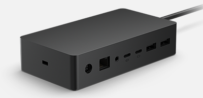

# Пробуждение по локальной сети с использованием Surface Dock 2

Чтобы поддерживать устройства в полной мере в курсе, ИТ-администраторы должны иметь возможность управлять устройствами, когда они не используются, как правило, во время ночных окон обслуживания. Surface Dock 2 обеспечивает лучшую поддержку wake on LAN (WOL), позволяя администраторам удаленно разбудить устройства Surface и автоматически выполнять задачи управления с помощью Microsoft Endpoint Manager или других сторонних решений.

## Требования

Устройства должны иметь проводное подключение к Surface Dock 2 и оставаться подключенными к ac Power.

> [!div class="mx-imgBorder"]
> 

> [!NOTE]
> Устройства для пробуждения, подключенные к Surface Dock 2, не требуют использования режима управления Enterprise Surface (SEMM) или включения параметров политики UEFI.
 
## Поддерживаемые устройства Surface

- Surface Laptop 4 (процессоры Intel)
- Surface Laptop 4 (процессоры AMD)
- Surface Laptop 3 (процессоры Intel)
- Surface Pro 8
- Surface Pro 7+
- Surface Pro 7
- Surface Pro X
- Surface Go (все поколения)
- Surface Laptop Go
- Surface Book 3
- Surface Laptop Studio

Surface Dock 2 обеспечивает поддержку WOL для устройств в следующих состояниях мощности:

- Режим ожидания с подключением
- Hibernation (состояние питания S4)
- Отключение (состояние питания S5 "soft off")

Дополнительные дополнительные информацию о состояниях власти см. в [дополнительных подробной информации о состояниях power system](/windows/win32/power/system-power-states).

## Принцип работы

Если устройства Surface не используются, они введите состояние с низким питанием, известное как Modern Standby или Connected Standby. Устройства могут быть в состоянии питания в режиме спячки (S4) или отключении (S5) в зависимости от параметров питания, настроенных на устройстве. ИТ-администраторы могут удаленно запускать устройства с помощью запроса на пробуждение (волшебный пакет), который содержит адрес управления доступом к мультимедиа (MAC) целевого устройства Surface. Многие решения управления, такие как Microsoft Endpoint Configuration Manager и сторонние Microsoft Store, предоставляют встроенную поддержку WOL.

Чтобы включить WOL на устройствах без Surface Dock 2, см.:

- [Wake on LAN for Surface devices](wake-on-lan-for-surface-devices.md)

## Подробнее

- [Surface Dock 2](https://www.microsoft.com/p/surface-dock-2-for-business/8q4hgc6kbmdq?)
- [Пробуждение по локальной сети для устройств Surface](wake-on-lan-for-surface-devices.md)
- [Состояния power system](/windows/win32/power/system-power-states)

